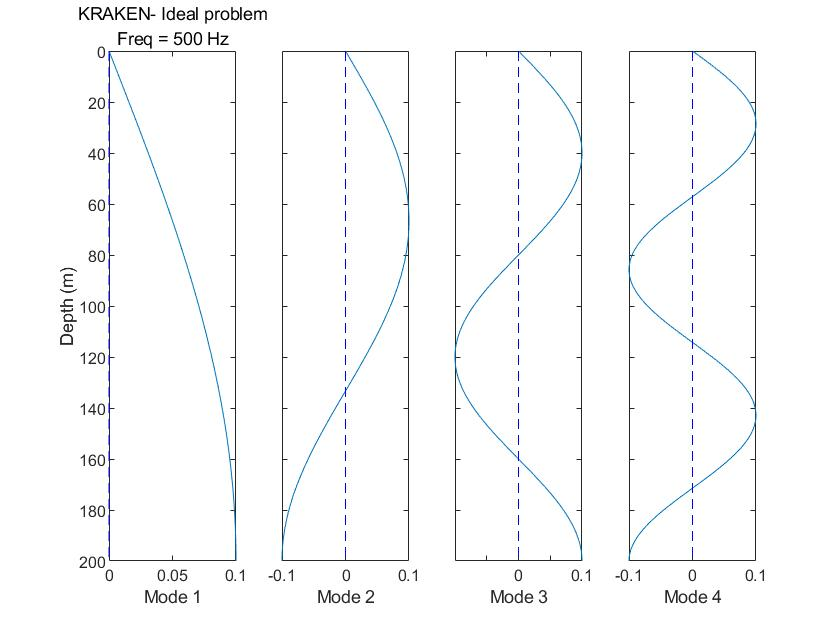
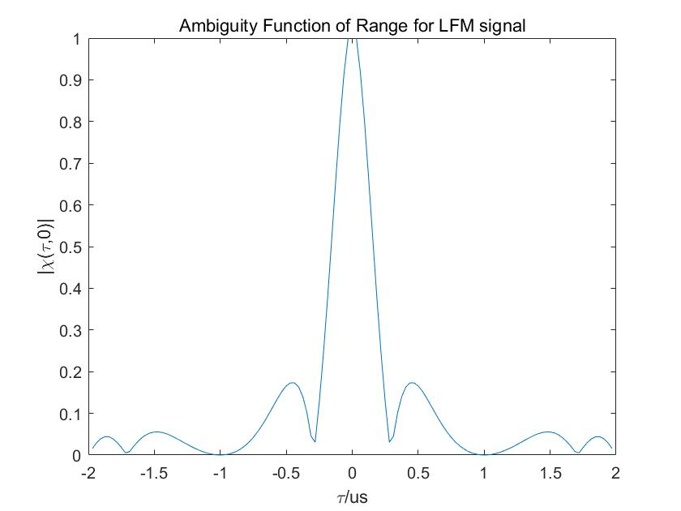
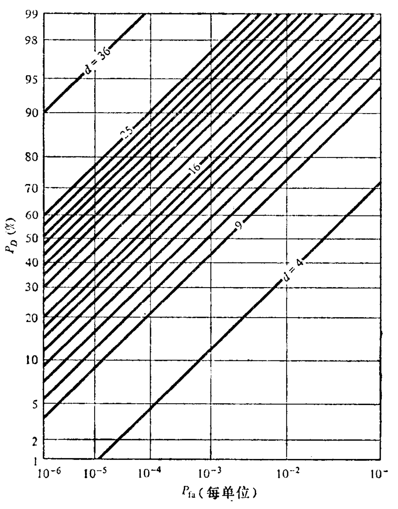

# 声纳与雷达系统 课程报告

吴天宇 工程师学院 12334125

## 历史篇

### 要求

综述声纳与雷达的发展史和类别。

### 综述

#### 发展史

声纳技术起源于第一次世界大战期间，最初为被动式，依赖于探测目标本身发出的声音。随着技术进步，尤其是换能器的发明，主动声纳应运而生，通过发射声波和侦听回声来定位目标。现代声纳技术已高度发展，包括多基地声纳、拖曳阵列声纳和合成孔径声纳，应用于海洋探索、环境监测、海底地形测绘和军事领域。

雷达技术的概念起源于19世纪，但直到20世纪初才开始发展。二战极大促进了雷达技术的发展和应用。现代雷达技术发展包括相控阵雷达、合成孔径雷达和隐身技术等先进形式，在民用和军用领域都有广泛应用。

#### 分类

声纳分为被动声纳和主动声纳。被动声纳依赖于目标发出的声波，应用于潜艇探测和海洋环境监测；主动声纳则主动发射声波并接收回声，用于水下导航和目标探测。根据设备布局，声纳可分为单基地和多基地系统。雷达系统则通过无线电波探测和定位物体，在航空导航、气象监测和军事侦察等领域得到应用。

## 入门篇

### 要求

综述声纳与雷达的构成和水声学原理。

### 综述

#### 声纳系统构成

声纳系统由多个关键部件组成。显控台负责各种模式的选择、参数设置、指令下传、数据上传，以及信息显示，如方位、距离、速度和类型。信号源生成各种波形、频率、脉宽、脉冲周期和脉冲数目。功放部分负责控制功率、效率、频率和失真度。换能器基阵用于声波的发射，其性能包括发射响应和发射指向性。水听器阵列则负责接收灵敏度和接收指向性。模拟端包括放大、滤波、模数转换，而数字端则负责数字下变频和基带处理。最后，系统分为湿端（水下部分）和干端（水面以上部分），分别负责不同的功能和操作。

#### 雷达系统构成

雷达系统的核心部件包括天线系统、接收机、信号处理器以及显示和控制单元。天线系统负责接收和发射无线电波，是系统的关键部分。接收机的作用是捕获从目标反射回来的信号。信号处理器分析接收到的信号，确定目标的位置、速度和其他重要特征。显示和控制单元则展示雷达数据，同时允许操作员控制雷达系统的各个方面。

#### 水声学原理

水声学原理是理解和应用声纳系统的基础。声纳方程是衡量声纳系统性能的核心，涵盖声源级 $SL$ 、传播损失 $TL$ 、噪声级 $NL$ 、指向性指数 $DI$ 、检测阈 $DT$ 、混响级 $RL$ 和目标强度 $TS$ 等要素。声压级、声强级和声功率级以分贝 dB 表示，用于描述声音的强度和功率。传播损失是描述声波在传播过程中能量损失的重要指标，而海洋环境噪声则直接影响声纳探测的能力。此外，声纳系统的工作原理基于线性时不变系统，涉及时域与频率、卷积与相关、傅里叶级数与变换等概念，这些都是水声学的基本组成部分。

## 物理篇

### 要求

利用 AT 工具箱完成 Ideal 波导和 Pekeris 波导声场计算

1. 利用 Kraken 计算简正模态，并绘制前几阶模态函数。

2. 分别使用简正波 Kraken 和射线 Bellhop 计算声场，并分析两者差异（声速剖面可选取深海和浅海的典型声速剖面）。

### 综述

### 推导

#### 波动方程

波动方程是描述声波在介质中传播的基本方程，它基于质量守恒和动量守恒的物理原理。在声纳与雷达技术中，波动方程考虑了密度扰动和速度场的关系，其质量守恒方程表达为：

$$\frac{\partial \rho'}{\partial t} = -\rho_0 \nabla \cdot \mathbf{v}$$

其中 $\rho'$ 是密度扰动， $\rho_0$ 是平均密度， $\mathbf{v}$ 是速度场。动量守恒，也称为欧拉方程，关联了速度场和压力扰动：

$$\frac{\partial \mathbf{v}}{\partial t} = -\frac{1}{\rho_0} \nabla p'$$

其中 $p'$ 表示压力扰动。状态方程进一步将压力扰动和密度扰动联系起来，对于线性介质，其形式为：

$$p' = \rho' c^2$$

其中 $c$ 是声速。结合这些方程，我们得到波动方程的标准形式：

$$\nabla^2 p - \frac{1}{c^2} \frac{\partial^2 p}{\partial t^2} = 0$$

$$\nabla^2 \phi - \frac{1}{c^2} \frac{\partial^2 \phi}{\partial t^2} = 0$$

$$\nabla^2 \psi - \frac{1}{c^2} \frac{\partial^2 \psi}{\partial t^2} = 0$$

其中 $p$ 代表声压， $\phi$ 和 $\psi$ 分别代表速度势和位移势，而 $\nabla^2$ 是拉普拉斯算子，表示空间的二阶导数。通过求解这些波动方程，可以预测声波在不同介质中的传播特性，这是声纳和雷达系统分析的基础。

#### 声传播模型

海洋声学环境通常非常复杂，具有距离和深度有关的特性，这种环境一般不适于对声传播作简单的分析预测。即使在距离无关的环境中，也存在许多路径，这些路径组合起来形成复杂的干涉图样。例如，收敛区是一个无法用单调几何扩展定律描述的更复杂结构的例子。声学模型在声传播预测中起着重要作用，这些模型的输入是海洋学量，最终转化为与声学有关的参数，如声速、密度和衰减。

海洋中的声传播用波动方程进行数学描述，波动方程的系数和边界条件由海洋环境导出。基本上有四种类型的模型(波动方程的计算机解)来描述海洋中的声传播，射线、频谱或快速场程序(FFP)、简正模态(NM)和抛物方程(PE)。射线理论是波动方程的一种渐近高频近似，而后三种模型或多或少是波动方程在各种温和约束下的直接解。高频极限不包括衍射现象。这些模型都能很好地处理海洋声环境的深度变化。同时考虑到环境水平变化(例如，倾斜的海底或空间可变的海洋学)的模型被称为距离有关模型。对于高频率(几 kHz 或以上)，射线理论最实用。其他三种类型在较低频率(1 kHz以下)下更适用和可用。水声模型的层次结构如图1所示。这些模型的输出通常是传播损失，即在单位距离上相对于单位源强度，以 dB 表示。传输损耗 Transmission Loss 是传播损失 Propagation Loss的 负值，因此是一个正值。不同模型之间存在差异，射线理论预测的阴影区比波动理论模型更尖锐。

    

#### Ideal 波导

Ideal 波导是用来描述在一个理想化环境中声波如何传播的。此模型假设声速在水平方向上是恒定的，并且在垂直方向上没有任何变化。

简正模态在理想波导中的展开可以表示为声压 $\Psi(r, z)$ 的傅里叶级数，其中包括了一系列正弦波形式的模态函数和相应的水平波数 $k_{rm}$ 。对于第 $m$ 个模态，垂直波数 $k_{zm}$ 和水平波数 $k_{rm}$ 可以表示为：

$$k_{zm} = \frac{m\pi}{D}$$

$$f_{0m} = \frac{mc}{2D}$$

这里的 $D$ 是波导的深度， $c$ 是声速， $f_{0m}$ 是第 $m$ 个模态的截止频率。而水平波数 $k_{rm}$ 可以通过下面的关系计算得到：

$$k_{rm} = \sqrt{k^2 - k_{zm}^2} = \sqrt{\left(\frac{\omega}{c}\right)^2 - \left(\frac{m\pi}{D}\right)^2}$$

其中， $\omega$ 是角频率， $c$ 是声速。

声压 $\Psi(r, z)$ 的模态展开形式如下：

$$\Psi(r, z) = -\frac{iS\omega}{2D} \sum_{m=1}^{\infty} \sin\left( k_{zm} z \right) \sin\left( k_{zm} z_s \right) H_0^{(1)} \left( k_{rm} r \right)$$

其中， $S$ 是源项， $z_s$ 是声源的深度， $H^{(1)}_0$ 是零阶第一类汉克尔函数，代表径向传播的声波。

声场的相速度 $v_m$ 和群速度 $u_m$ 分别由下列公式给出：

$$v_m = \frac{\omega}{k_{rm}}$$

$$u_m = \frac{d\omega}{dk_{rm}}$$

Ideal 波导提供了一个简单的框架来理解声波在海洋环境中的基本传播特性，但它忽略了实际海洋环境中的许多复杂因素，如声速剖面的变化、海底的反射和散射等。

#### Pekeris 波导

Pekeris 波导是用来描述在理想条件下声波在水下的传播情况。Pekeris 波导考虑了一个由两层介质组成的简化模型，其中包括一层水体和一层具有不同声学特性的海底。这一模型可以通过数学方式表达和计算不同模态下的声场分布。

在模态展开中，声场可以表示为无穷级数的和，其中每一项都是一个模态的贡献。对于第一模态 Mode 1，其声场可以表示为：

$$\psi(r, z) \approx -\frac{iS}{2D} \sum_{m=1}^{\infty} \alpha_m \left( k_{rm} \right) \sin\left( k_{zm} z \right) \sin\left( k_{zm} z_s \right) H_0^{(1)} \left( k_{rm} r \right)$$

这里， $\psi(r, z)$ 是声场的表达式， $i$ 是虚数单位， $S$ 代表声源强度， $D$ 代表水层深度， $\alpha_m$ 是与第 $m$ 个模态相关的系数， $k_{rm}$ 和 $k_{zm}$ 分别是水平和垂直波数， $z$ 是深度变量， $z_s$ 是声源深度， $H_0^{(1)}$ 是第一类零阶汉克尔函数（Hankel function），用于描述远场条件下声波的辐射模式， $r$ 是距离变量。

每个模态的截止频率由以下公式给出：

$$f_{0m} = \left( m - \frac{1}{2} \right) \frac{c_1}{2D} \sqrt{ c_2^2 - c_1^2 }$$

其中， $f_{0m}$ 是第 $m$ 个模态的截止频率， $c_1$ 和 $c_2$ 分别是两层介质中的声速， $D$ 仍然代表水层深度。

#### Kraken 简正波模型

Kraken 简正波模型用于分析和预测海洋环境中的声波传播。基于波动方程，该模型利用简正波分解直接求解，适用于低频远场条件。

波动方程的垂直部分：

$$ \frac{d^2F}{dz^2} + (k^2 - \zeta^2)F = 0 $$

其中， $F(z)$ 是垂直模态函数， $k$ 是波数， $\zeta$ 是水平波数。

波动方程的径向部分:

$$ \frac{d^2S}{dr^2} + \frac{1}{r}\frac{dS}{dr} + \zeta^2S = 0 $$

其中， $S(r)$ 是径向模态函数。

声场由模态函数表示，对于远场条件，声场的表达式简化为：

$$ \Phi = \sum_{n} \frac{u_n(z) \cdot u_n(z_0)}{\sqrt{\zeta_n}} \exp(i(\zeta_n r - \pi/4)) \exp(-\delta_n r) $$

其中， $u_n(z)$ 是第 $n$ 个模态的垂直模态函数， $\zeta_n$ 是水平波数， $\delta_n$ 是衰减系数。

对于大的远场条件 $r$ ，零阶汉克尔函数近似为：

$$ H_0^{(1)}(\zeta r) \approx \sqrt{\frac{2}{\pi \zeta r}} e^{i(\zeta r-\pi/4)} $$

    

#### Bellhop 射线模型

Bellhop 射线模型是一个基于几何声学的水下声场计算模型，用于高频声信号的传播分析，它假设声波沿着由声速剖面决定的路径即声线传播。声场 $\Phi$ 通常表示为复振幅 $A$ 的指数形式：

$$ \Phi = A e^{i\Psi} $$

在几何声学近似和高频近似下，波动方程可以简化为：

$$ \frac{1}{A} \nabla^2 A - [\nabla \Psi]^2 + k^2 = 0 $$

其中， $[\nabla \Psi]^2 = k^2$ 是高频近似下的简化结果。

射线方程，或称 Eikonal 方程，描述波在非均匀介质中的传播：

$$ 2[\nabla A \cdot \nabla \Psi] + A \nabla^2 \Psi = 0 $$

当频率 $f$ 超过某个阈值，声波可以在声速剖面创建的导管中传播，导管深度 $H$ 和声速 $c$ 对此现象至关重要。此外，射线模型也与波粒二象性量子理论相呼应，反映了声波的波动性和粒子性质。

    

Bellohop 模型通过高斯波束跟踪方法，计算水平非均匀环境中的声场。高斯波束跟踪方法对于高频水平变化问题特别有吸引力，这是简正波、波数积分和抛物线模型不可替代的。高斯束射线跟踪法的基本思想是将高斯强度分布与每条声线联系起来，该声线为高斯声束的中心声线，这些声线能较平滑的过渡到声影区，也能较平滑的穿过焦散线，所提供的结果与全波动模型的结果更为一致。在频率范围为600Hz-30kHz时与实验数据及理论模型符合得很好。

Bellohop 在通过相关命令来读取可以描述发送端和接收端的环境和几何特性文件。MATLAB 画图程序 ( `plotssp`, `plotbty`, `plotbrc`, etc. ) 用来显示每一个输入文件， `*.env` 描述水体环境， `*.flp` 描述声源和接收器的位置， `*.prt` 描述计算参数， `*.ati` 描述海面形状， `*.bty` 描述海底形状， `*.trc` 描述顶部反射系数， `*.brc` 描述底部反射系数。

Bellohop 在整体环境文件中通过相关选项来产生不同的输出文件， `*.ray` 描述声线和本征声线， `*.shd` 描述声线的传播损失， `*.arr` 描述声线到达的时间-幅度序列等参数。

#### 声速剖面

声速剖面通常呈现出随深度变化的非线性特征。声速在声速极小值层或声速通道附近达到最小值，这个区域是由于水温降低和压力增加所共同作用的结果。在声速通道中，声波能够在减小的衰减下进行长距离传播。

声速剖面可以用以下数学公式近似表达：

$$ c(z) = c_0 + a(z - z_0) + b(z - z_0)^2 + \ldots $$

其中， $c(z)$ 是深度 $z$ 处的声速， $c_0$ 是参考深度 $z_0$ 处的声速， $a$ 和 $b$ 是系数，表示声速随深度变化的趋势。

使用 `plotssp` 函数绘制浅海的声速剖面。

    

### 仿真

使用 AT 工具箱在 MATLAB 进行声场仿真，在 [`Sound_Field_Caculation`](./Sound_Field_Caculation) 中包含用于声场仿真的 MATLAB 代码和资源。

[`Sound_Field_Caculation/lib`](./Sound_Field_Caculation/lib) 包含多个MATLAB脚本和可执行文件，这些文件为整个仿真提供了必要的计算工具和函数库。其中的MATLAB脚本，如 `read_*.m` 脚本用于读取和处理不同类型的数据文件， `plot*.m` 等脚本则用于绘制和分析仿真结果，[`kraken.exe`](./Sound_Field_Caculation/lib/kraken.exe) 和 [`bellhop.exe`](./Sound_Field_Caculation/lib/bellhop.exe) 是 AT 工具箱仿真的核心计算可执行文件。

[`Sound_Field_Caculation/conf`](./Sound_Field_Caculation/conf) 包含各种环境文件和输出结果文件，为仿真提供了必要的声学特性定义和条件。在这个文件夹中，`*.env`文件定义了仿真所需的声学环境特性，如声速剖面、水深和底部特性，`*.flp` 和 `*.prt` 文件涉及仿真参数的设置或结果的后处理，`*.shd` 文件存储了仿真过程中计算出的声场分布。

[`Sound_Field_Caculation`](./Sound_Field_Caculation) 中的 `*.m` 是仿真的主要脚本。[`kraken_main.m`](./Sound_Field_Caculation/kraken_main.m) 用于执行 Kraken 模型的仿真计算，处理与深水或复杂声学环境相关的声场问题，[`bellhop_main.m`](./Sound_Field_Caculation/bellhop_main.m) 用于 Bellhop 模型，适用于浅水或简化环境下的声场仿真。

[`Sound_Field_Caculation/results`](./Sound_Field_Caculation/results) 包含仿真结果，展示了声场的分布、模态结构、声速剖面等。

#### 模态计算

[`kraken_Ideal_range_depth_mode.jpg`](./Sound_Field_Caculation/results/kraken_Ideal_range_depth_mode.jpg) 和 [`kraken_Ideal_range_depth_mode_index.jpg`](./Sound_Field_Caculation/results/kraken_Ideal_range_depth_mode_index.jpg)是 Kraken 模型在 Ideal 波导下的简正模态。

    

[`kraken_Pekeris_range_depth_mode.jpg`](./Sound_Field_Caculation/results/kraken_Pekeris_range_depth_mode.jpg) 和 [`kraken_Pekeris_range_depth_mode_index.jpg`](./Sound_Field_Caculation/results/kraken_Pekeris_range_depth_mode_index.jpg)是 Kraken 模型在 Pekeris 波导下的简正模态。

    

#### 声场计算

[`kraken_Ideal_range_shd.jpg`](./Sound_Field_Caculation/results/kraken_Ideal_range_shd.jpg) 是 Kraken 模型在 Ideal 波导条件下的声场传输损失 TL 随距离 Range 的变化。传输损失是衡量声波在传播过程中能量损失的指标，尤其是衡量远距离传播时的能量衰减情况。

    

[`kraken_Ideal_range_depth_shd.jpg`](./Sound_Field_Caculation/results/kraken_Ideal_range_depth_shd.jpg) 是 Kraken 模型在 Ideal 波导条件下声场在水平距离和深度上的分布，其中颜色的变化代表了不同声压级的分布。

    

[`kraken_Pekeris_range_shd.jpg`](./Sound_Field_Caculation/results/kraken_Pekeris_range_shd.jpg) 是 Kraken 模型在 Pekeris 波导条件下的声场传输损失 TL 随距离 Range 的变化。传输损失是衡量声波在传播过程中能量损失的指标，尤其是衡量远距离传播时的能量衰减情况。

    

[`kraken_Pekeris_range_depth_shd.jpg`](./Sound_Field_Caculation/results/kraken_Pekeris_range_depth_shd.jpg) 是 Kraken 模型在 Pekeris 波导条件下声场在水平距离和深度上的分布，其中颜色的变化代表了不同声压级的分布。

    

[`bellhop_Ideal_range_depth.jpg`](./Sound_Field_Caculation/results/bellhop_Ideal_range_depth.jpg) 是 Bellhop 模型在 Ideal 波导条件下声场在水平距离和深度上的分布，其中颜色的变化代表了不同声压级的分布。

    

[`bellhop_Pekeris_range_depth.jpg`](./Sound_Field_Caculation/results/bellhop_Pekeris_range_depth.jpg) 是 Bellhop 模型在 Pekeris 波导条件下声场在水平距离和深度上的分布，其中颜色的变化代表了不同声压级的分布。

    

## 波形篇

### 要求

典型波形的模糊以及信道输出和信道响应

1. 生成典型波形（如 CW、LFM、HFM、M 码、巴克码、Gold 码、FMCW 等）。

2. 计算并绘制典型波形的模糊度图（含上调频和下调频，至少对比两种不同时间带宽积情况下模糊度图）。

3. 任选两种波形作为 Bellhop 声场软件的信号输入，计算并绘制输出波形，分析其与输入信号之间的差异。

4. 利用输入和输出信号计算水声信道脉冲响应和频率响应，分析其与信道真实响应之间的差异。

### 综述

### 推导

#### 波形生成

##### 窄带信号（带限、带通）

窄带信号是指其频谱集中在一个较窄的频带内的信号。这类信号通常经过带通滤波器进行处理，以限制其频谱范围。数学上，窄带信号可以表示为：

$$s(t) = A(t) \cos(2\pi f_c t + \phi(t))$$

其中 $A(t)$ 是信号的包络， $f_c$ 是载波频率， $\phi(t)$ 是相位信息。

回波窄带信号是指经过窄带处理的回波信号，它仅包含目标反射回来的特定频率范围内的信号。回波基带复包络是指将回波窄带信号通过解调转换到基带的信号包络，与基带复包络的概念相同，但应用于回波信号。

##### 基带复包络

基带复包络是指将高频载波信号通过解调转换到低频（基带）上的信号包络。它包含了原始信号的幅度和相位信息。数学表示为：

$$s_{\text{base}}(t) = A(t) e^{j\phi(t)}$$

##### 希尔伯特变换

希尔伯特变换用于从实值信号生成解析信号，解析信号具有实部和虚部。数学上，希尔伯特变换定义为：

$$\hat{s}(t) = \frac{1}{\pi} \text{P.V.} \int_{-\infty}^{\infty} \frac{s(\tau)}{t - \tau} d\tau$$

其中， $\text{P.V.}$ 表示柯西主值。

##### 正交解调

正交解调是将接收到的信号分解为两个正交分量（同相分量和正交分量）的过程。对于信号 $s(t) = A(t) \cos(2\pi f_c t + \phi(t))$ ，其同相分量 $I(t)$ 和正交分量 $Q(t)$ 可以表示为：

$$I(t) = A(t) \cos(\phi(t))$$

$$Q(t) = A(t) \sin(\phi(t))$$

##### 解析信号

解析信号是将实值信号扩展到复平面的信号，其实部为原信号，虚部为原信号的希尔伯特变换。数学上，对于信号 $s(t)$ ，其解析信号表示为：

$$s_{\text{analytic}}(t) = s(t) + j\hat{s}(t)$$

##### 多普勒频移

时延是指信号从发射到接收之间的时间差。多普勒频移是指由于相对运动引起的频率变化。对于一个运动中的目标，其反射回波的多普勒频移可以表示为：

$$f_d = \frac{2v}{\lambda}$$

其中 $f_d$ 是多普勒频移， $v$ 是目标相对于观察者的速度， $\lambda$ 是波长。

#### 匹配滤波器

匹配滤波器是一种信号处理技术，用于最大化信号和已知模板之间的相关性。在白噪声环境下，匹配滤波器可以最大化接收信号的信噪比（SNR）。匹配滤波器的脉冲响应 $h_{mf}(t)$ 与发送信号的时间反转复共轭有关，数学表达为：

$$h_{mf}(t) = k \cdot u^*(t_1 - t)$$

其中， $u(t)$ 是发送信号， $k$ 是常数因子， $t_1$ 是时间反转的参考点。对应的频率响应 $H_{mf}(f)$ 是：

$$H_{mf}(f) = k \cdot U^*(f)e^{-j2\pi f t_1}$$

匹配滤波器输出的信噪比（SNR）由下式给出：

$$\frac{S}{N}_{mf} = \frac{2E}{N_0}$$

其中， $E$ 是接收回波的能量， $N_0$ 是单位频带内的白噪声功率谱密度。

匹配滤波器的增益可以通过输出和输入SNR的比值来定义：

$$TB = \frac{SNR_{output}}{SNR_{input}}$$

这里 $TB$ 是时间-带宽积。

#### 脉冲压缩

脉冲压缩是一种信号处理技术，主要用于雷达和声纳系统，以提高距离分辨率和信噪比。它涉及到时域和频域的处理方法。

##### 时域脉冲压缩

时域脉冲压缩是通过匹配滤波来实现的。匹配滤波器的脉冲响应是传输脉冲的时间反转和复共轭。在白噪声条件下，匹配滤波器可以最大化输出的信噪比。具体的数学表达为：

$$h(t) = s^*(-t)$$

其中， $h(t)$ 是匹配滤波器的脉冲响应， $s(t)$ 是传输脉冲。

##### 频域脉冲压缩

频域脉冲压缩是在频域通过滤波实现的，与时域脉冲压缩对应。在频域中，匹配滤波器的频率响应是传输信号频谱的复共轭。其表达式为：

$$H(f) = S^*(f)$$

其中， $H(f)$ 是匹配滤波器的频率响应， $S(f)$ 是传输信号的频谱。

##### LFM 脉冲压缩

LFM（线性频率调制）脉冲压缩是通过线性调频信号来实现的。它结合了短脉冲的高距离分辨率和长脉冲的高速度分辨率的优点。LFM信号具有一个大的时间-带宽积（TB），其中 TB 值为10意味着比 CW（连续波）脉冲有更高的距离分辨率和速度分辨率，同时也能实现更远的作用距离。

LFM脉冲压缩的数学表达式为：

$$s(t) = \cos(2\pi f_0 t + \pi \beta t^2)$$

其中， $f_0$ 是中心频率， $\beta$ 是调频率， $t$ 是时间。

##### HFM 脉冲压缩

HFM（高斯频率调制）脉冲压缩是通过高斯调频信号来实现的。它结合了短脉冲的高距离分辨率和长脉冲的高速度分辨率的优点。 HFM 信号具有一个大的时间-带宽积，其中 TB 值为10意味着比 CW（连续波）脉冲有更高的距离分辨率和速度分辨率，同时也能实现更远的作用距离。

HFM脉冲压缩的数学表达式为：

$$s(t) = \cos(2\pi f_0 t + \pi \beta t^2)$$

其中， $f_0$ 是中心频率， $\beta$ 是调频率， $t$ 是时间。

#### 模糊函数

模糊函数（Ambiguity Function）是描述信号在时延和多普勒频移（Doppler Shift）下的相似度。对于基带信号 $u(t)$ ，其模糊函数 $X_u(\tau, f_d)$ 定义为：

$$X_u(\tau, f_d) = \int_{-\infty}^{\infty} u(t)u^*(t + \tau)e^{-j2\pi f_d t} dt$$

其中， $\tau$ 是相对时间延迟， $f_d$ 是多普勒频移。模糊函数的绝对值平方 $|\Psi_u(\tau, f_d)|^2$ 表示信号在时延和多普勒频移下的能量分布。

模糊度图（Ambiguity Diagram）是模糊函数的图形表示，通常在延迟-多普勒 $\tau$-$f_d$ 坐标系中描绘，用于直观显示信号的时间-频率分辨能力。模糊度图通常显示为一个三维图，其中峰值表示主瓣，而其它结构表示旁瓣。

    

##### 基带复包络的自相关函数

基带复包络的自相关函数是信号自身与其时间延迟版本的卷积，描述了信号在不同时间延迟下的自相似性，定义为：

$$R_u(\tau) = \int_{-\infty}^{\infty} u(t)u^*(t + \tau) dt$$

##### 匹配滤波器输出

匹配滤波器输出是接收信号和匹配滤波器脉冲响应的卷积，它等同于基带复包络的自相关函数的时间反转。如果 $u(t)$ 是发送信号，匹配滤波器输出 $y(t)$ 为：

$$y(t) = \int_{-\infty}^{\infty} u(t)u^*(t' - t)e^{-j2\pi f_d t'} dt'$$

##### 时频分析

时频分析是一种分析信号在时间和频率上变化的技术。一些常用的时频分析方法包括短时傅里叶变换（STFT）、连续小波变换（CWT）、离散小波变换（DWT）等。

时域波形是信号在时间上的表示，而频域频谱是信号在频率上的表示。通过傅里叶变换可以将时域波形转换为频域频谱，反之亦然。

时频分辨率与 Heisenberg 不确定原理说明了在时频分析中，时间分辨率 $\Delta t$ 和频率分辨率 $\Delta f$ 不能同时任意精确，它们的乘积受到限制：

$$\Delta t \cdot \Delta f \geq \frac{1}{2}$$

这表明信号的时间和频率特性存在一个基本的权衡。

#### 简单信号

简单信号（Simple Signal）通常指的是具有确定时间带宽积（TB）的信号。时间带宽积是信号持续时间和带宽的乘积，是信号设计中一个重要的参数。在声纳和雷达系统中，简单信号通常用于基本的目标检测和定位。

##### 时间带宽积 TB

时间带宽积描述了信号的时域和频域特性之间的权衡关系。对于简单信号，时间带宽积通常满足以下条件：

当 $TB = 1$ 时，信号为最佳匹配脉冲，提供最好的时间解析能力。当 $TB >> 1$ 时，信号可以提供更好的多普勒解析能力。

##### CW脉冲

CW脉冲，连续波（Continuous Wave）脉冲，其时间带宽积较小，主要用于测量目标的距离。其特性可以用以下公式描述：

$$\Delta R = \frac{c \tau_e}{2} = \frac{c}{2 B_e}$$

$$\Delta f_d = \frac{1}{\tau_e}$$

其中， $c$ 是声速， $\tau_e$ 是信号的有效持续时间， $B_e$ 是信号的有效带宽， $\Delta R$ 是距离分辨率， $\Delta f_d$ 是多普勒分辨率。

有效持续时间 $\tau_e$ 和有效带宽 $B_e$ 可以分别通过信号的自相关函数和功率谱密度来计算：

$$\tau_e = \frac{\int_{-\infty}^{\infty} |x(t)|^2 dt}{\int_{-\infty}^{\infty} |x(t)|^4 dt}$$

$$B_e = \frac{\int_{-\infty}^{\infty} |X(f)|^2 df}{\int_{-\infty}^{\infty} |X(f)|^4 df}$$

其中 $x(t)$ 是信号的时域表达式， $X(f)$ 是信号的频域表达式。

以上公式说明了简单信号在设计时需要考虑的时延和多普勒特性，以及如何通过信号的形状来调整这些特性，以满足特定的应用需求。

#### 复杂信号

复杂信号在雷达和声纳系统中指的是时间带宽积（TB）远大于1的信号。这类信号在时间域或频域具有高分辨率，使得系统能够精确测定目标的距离和速度。

##### 时延估计标准差

时延估计标准差 $\sigma_\tau$ 衡量系统估计接收信号时延的精度。在雷达方程中，其表示为：

$$\sigma_\tau = \frac{1}{B_{rms} \sqrt{2E/N_0}}$$

其中 $B_{rms}$ 是信号的均方根带宽， $E$ 是信号能量， $N_0$ 是噪声功率谱密度。该公式表明，信号带宽和能量越高，噪声功率越低，时延估计的精度越高。

$$B_{rms}^2 = \frac{\int_{-\infty}^{\infty} (2\pi f)^2 |X(f)|^2 df}{\int_{-\infty}^{\infty} |X(f)|^2 df}$$

其中 $X(f)$ 是信号 $x(t)$ 的傅里叶变换。这个表达式计算了考虑信号功率谱密度的平均频率平方。

##### Doppler频移估计标准差

Doppler频移估计标准差 $\sigma_{f_d}$ 衡量系统在估计信号的Doppler频移方面的精度，与目标相对于发射器的速度有关。其表示为：

$$\sigma_{f_d} = \frac{1}{\tau_{rms} \sqrt{2E/N_0}}$$

其中 $\tau_{rms}$ 是信号的均方根脉冲宽度。这反映了更长的脉冲宽度（通常意味着更长的观测时间）和更高的信号能量可以提高Doppler频移估计的准确性。

$$\tau_{rms}^2 = \frac{\int_{-\infty}^{\infty} (2\pi t)^2 |x(t)|^2 dt}{\int_{-\infty}^{\infty} |x(t)|^2 dt}$$

其中 $x(t)$ 是信号的时域表达式。该公式计算了信号能量在时间上分布的平均持续时间平方。

#### 调频信号 FM

调频信号FM是一种其频率随时间变化以携带信息的信号。在FM信号中，信息不是通过振幅而是通过频率的变化来编码。

调频信号的瞬时相位 $\phi(t)$ 和瞬时频率 $f(t)$ 表达为：

$$\phi(t) = 2\pi \left( f_0t + \frac{\mu t^2}{2} \right), \quad -\frac{\tau_0}{2} \leq t \leq \frac{\tau_0}{2}$$

$$f(t) = \frac{1}{2\pi} \frac{d\phi(t)}{dt} = f_0 + \mu t$$

其中 $f_0$ 是信号的中心频率， $\mu$ 是调频率， $t$ 是时间。

##### 线性调频 LFM

线性调频LFM是调频信号的一种，其频率随时间线性变化。这种信号在雷达系统中常用于提高距离分辨率。LFM信号的表达式为：

$$x_1(t) = \text{Rect}\left(\frac{t}{\tau_0}\right) e^{j2\pi(f_0t + \mu t^2 / 2)}$$

其中 $\text{Rect}(\cdot)$ 是矩形函数， $\tau_0$ 是脉冲宽度， $f_0$ 是起始频率， $\mu$ 是频率调制斜率。

##### 非线性调频 NFLM

非线性调频NFLM信号的频率随时间以非线性方式变化。这种信号可以提供比线性调频更复杂的频率模式，有时用于特定的雷达应用以优化系统性能。

##### 双曲调频 HFM

双曲调频HFM是一种频率随时间按照双曲线关系变化的调频信号。HFM信号在时间域内通常具有更广的带宽，这使得它们在雷达系统中能提供更好的目标分辨能力。

#### 编码调制脉冲 CMP

编码调制脉冲CMP是一种雷达信号处理技术，通过使用特定的编码序列来调制脉冲信号，以达到降低旁瓣、提高信号增益和改善信号可检测性的目的。

##### Barker码

Barker码是一种特殊的二进制码，它具有优秀的自相关性质，使得在匹配滤波后，主峰与旁瓣的比值最大化，从而提高信号的检测性能。最长的已知Barker码长度为13。

##### M码

M码是由线性移位寄存器（LSR）生成的伪随机二进制序列，通常用于生成具有良好统计特性的宽带信号。它们在雷达和通信系统中用于同步和数据传输。

##### Gold码

Gold码是一种由两个互质的最大长度序列（m序列）通过特定规则组合而成的二进制码序列。Gold码在互相关和自相关性质上优于单个m序列，通常用于雷达和无线通信中的扩频技术。

#### 水声信道

##### 脉冲响应

水声信道的脉冲响应是描述在特定的空间位置 $p$ ，时间 $t$ 和频率 $f$ 下，声信号在水声信道中传播的特性。如果假设水声信道是一个线性时不变系统，则其脉冲响应函数 $h(p, t, f)$ 能够完全表征信道的传输特性。发射信号 $x(p, t, f)$ 通过水声信道后，接收信号 $y(p, t, f)$ 可以通过脉冲响应与输入信号的卷积来表示。

$$y(p, t) = \int_{-\infty}^{\infty} h(p, \tau) x(p, t - \tau) d\tau$$

其中 $x(p, t)$ 是发射信号， $h(p, t)$ 是水声信道的脉冲响应函数， $y(p, t)$ 是接收信号。

##### 频率响应

频率响应是水声信道在不同频率下的响应特性，它通常是脉冲响应函数的傅里叶变换。频率响应描述了不同频率成分的信号经过信道后的放大或衰减程度。

##### 真实响应

信道真实响应是指在实际环境中，由于水声信道的非均匀性和时变性，信号在传播过程中所受到的影响，包括路径损失、多径效应、Doppler扩展等因素的综合效果。

### 仿真

使用 MATLAB 进行波形仿真，完成波形生成、模糊度函数计算、模糊度图计算等。在 [`Signal_Ambiguity_Function`](./Signal_Ambiguity_Function) 中包含用于波形仿真的 MATLAB 代码和资源。

[`Signal_Ambiguity_Function/lib`](./Signal_Ambiguity_Function/lib) 包含 MATLAB 脚本和函数，为信号模糊函数的计算提供了必要的工具和函数库。

[`Signal_Ambiguity_Function`](./Signal_Ambiguity_Function) 中的 `*.m` 是主要的仿真脚本。[`Signal_Ambiguity_Function.m`](./Signal_Ambiguity_Function/Signal_Ambiguity_Function.m) 调用 `af_sp`、`af_gauss` 和 `af_lfm` 等函数计算了几种信号的模糊函数，并生成了相应的三维表面图、3dB衰减等高线图、零多普勒频移时的模糊函数图和零时间延迟时的模糊函数图。

[`Signal_Ambiguity_Function/results`](./Signal_Ambiguity_Function/results) 包含仿真结果，展示信号模糊函数。

#### 模糊函数计算

##### 单脉冲 SP 信号

单脉冲信号（单载频矩形脉冲信号），是一种在固定频率下发射的矩形脉冲信号。

$$
s(t) = \begin{cases} 
A, & \text{if } |t| \leq \frac{T_p}{2} \\
0, & \text{otherwise} 
\end{cases}
$$

其中 $A$ 是信号幅度， $T_p$ 是脉冲宽度。

模糊函数是用于描述信号在时间延迟 $\tau$ 和多普勒频移 $f_d$ 下的变化情况。单脉冲信号的模糊函数定义为：

$$\chi(\tau, f_d) = \int_{-\infty}^{+\infty} s(t) s^*(t - \tau) e^{-j2\pi f_d t} dt$$

模糊函数的三维表面图 [`Ambiguity_Function_for_SP_Signal.jpg`](./Signal_Ambiguity_Function/results/Ambiguity_Function_for_SP_Signal.jpg) 是将模糊函数 $\chi(\tau, f_d)$ 在三维空间（时间延迟 $\tau$ 、多普勒频移 $f_d$ 和幅值）中表示。

    

3dB衰减等高线 [`Ambiguity_Diagram_for_SP_Signal.jpg`](./Signal_Ambiguity_Function/results/Ambiguity_Diagram_for_SP_Signal.jpg) 是指模糊函数幅值下降到最大值的一半（即最大值的 -3dB ）时的 $\tau$ 和 $f_d$ 的轮廓线。

    

当多普勒频移 $f_d = 0$ 时，单脉冲信号的模糊函数专注于时间延迟 $\tau$ 的影响：

$$\chi(\tau, 0) = \int_{-\infty}^{+\infty} s(t) s^*(t - \tau) dt$$

零多普勒频移时的模糊函数 [`Ambiguity_Function_of_Range_for_SP_Signal.jpg`](./Signal_Ambiguity_Function/results/Ambiguity_Function_of_Range_for_SP_Signal.jpg) 是将模糊函数 $\chi(\tau, 0)$ 在时间延迟 $\tau$ 和幅值之间表示。

    

当时间延迟 $\tau = 0$ 时，单脉冲信号的模糊函数专注于多普勒频移 $f_d$ 的影响。

零时间延迟时的模糊函数 [`Ambiguity_Function_of_Velocity_for_SP_Signal.jpg`](./Signal_Ambiguity_Function/results/Ambiguity_Function_of_Velocity_for_SP_Signal.jpg) 是将模糊函数 $\chi(0, f_d)$ 在多普勒频移 $f_d$ 和幅值之间表示。

$$\chi(0, f_d) = \int_{-\infty}^{+\infty} s(t) s^*(t) e^{-j2\pi f_d t} dt$$

    

##### 高斯脉冲 Gauss 信号

高斯脉冲信号（单载频高斯脉冲模糊函数），是一种以高斯函数形式调制的脉冲信号。

$$s(t) = A e^{-\pi \beta^2 t^2} e^{j2\pi f_0 t}$$

其中， $A$ 是信号的幅度， $\beta$ 是调频率，表示脉冲宽度的倒数， $f_0$ 是中心频率。

模糊函数是用于描述信号在时间延迟 $\tau$ 和多普勒频移 $f_d$ 下的变化情况。高斯脉冲信号的模糊函数定义为：

$$\chi(\tau, f_d) = \int_{-\infty}^{+\infty} s(t) s^*(t - \tau) e^{-j2\pi f_d t} dt$$

模糊函数的三维表面图 [`Ambiguity_Function_for_Gaussian_Pulse_Signal.jpg`](./Signal_Ambiguity_Function/results/Ambiguity_Function_for_Gaussian_Pulse_Signal.jpg) 是将模糊函数 $\chi(\tau, f_d)$ 在三维空间（时间延迟 $\tau$ 、多普勒频移 $f_d$ 和幅值）中表示。

    

3dB衰减等高线 [`Ambiguity_Diagram_for_Gaussian_Pulse_Signal.jpg`](./Signal_Ambiguity_Function/results/Ambiguity_Diagram_for_Gaussian_Pulse_Signal.jpg) 是指模糊函数幅值下降到最大值的一半（即最大值的 -3dB ）时的 $\tau$ 和 $f_d$ 的轮廓线。

    

当多普勒频移 $f_d = 0$ 时，高斯脉冲信号的模糊函数专注于时间延迟 $\tau$ 的影响：

$$\chi(\tau, 0) = \int_{-\infty}^{+\infty} s(t) s^*(t - \tau) dt$$

零多普勒频移时的模糊函数 [`Ambiguity_Function_of_Range_for_Gaussian_Pulse_Signal.jpg`](./Signal_Ambiguity_Function/results/Ambiguity_Function_of_Range_for_Gaussian_Pulse_Signal.jpg) 是将模糊函数 $\chi(\tau, 0)$ 在时间延迟 $\tau$ 和幅值之间表示。

    

当时间延迟 $\tau = 0$ 时，高斯脉冲信号的模糊函数专注于多普勒频移 $f_d$ 的影响。

$$\chi(0, f_d) = \int_{-\infty}^{+\infty} s(t) s^*(t) e^{-j2\pi f_d t} dt$$

零时间延迟时的模糊函数 [`Ambiguity_Function_of_Velocity_for_Gaussian_Pulse_Signal.jpg`](./Signal_Ambiguity_Function/results/Ambiguity_Function_of_Velocity_for_Gaussian_Pulse_Signal.jpg) 是将模糊函数 $\chi(0, f_d)$ 在多普勒频移 $f_d$ 和幅值之间表示。

    

##### 线性调频 LFM 信号

线性调频信号（线性调频脉冲信号），是一种以线性调频方式调制的脉冲信号。

$$s(t) = \text{Rect}\left(\frac{t}{\tau_0}\right) e^{j2\pi(f_0t + \beta t^2 / 2)}$$

其中， $\text{Rect}(\cdot)$ 是矩形函数， $\tau_0$ 是脉冲宽度， $f_0$ 是起始频率， $\beta$ 是频率调制斜率。

模糊函数是用于描述信号在时间延迟 $\tau$ 和多普勒频移 $f_d$ 下的变化情况。线性调频信号的模糊函数定义为：

$$\chi(\tau, f_d) = \int_{-\infty}^{+\infty} s(t) s^*(t - \tau) e^{-j2\pi f_d t} dt$$

模糊函数的三维表面图 [`Ambiguity_Function_for_LFM_signal_B_4e5.jpg`](./Signal_Ambiguity_Function/results/Ambiguity_Function_for_LFM_signal_B_4e5.jpg) [`Ambiguity_Function_for_LFM_signal_B_4e6.jpg`](./Signal_Ambiguity_Function/results/Ambiguity_Function_for_LFM_signal_B_4e6.jpg) 是将模糊函数 $\chi(\tau, f_d)$ 在三维空间（时间延迟 $\tau$ 、多普勒频移 $f_d$ 和幅值）中表示。

    

3dB衰减等高线 [`Ambiguity_Diagram_for_LFM_signal_B_4e5.jpg`](./Signal_Ambiguity_Function/results/Ambiguity_Diagram_for_LFM_signal_B_4e5.jpg) [`Ambiguity_Diagram_for_LFM_signal_B_4e6.jpg`](./Signal_Ambiguity_Function/results/Ambiguity_Diagram_for_LFM_signal_B_4e6.jpg) 是指模糊函数幅值下降到最大值的一半（即最大值的 -3dB ）时的 $\tau$ 和 $f_d$ 的轮廓线。

    

当多普勒频移 $f_d = 0$ 时，线性调频信号的模糊函数专注于时间延迟 $\tau$ 的影响：

$$\chi(\tau, 0) = \int_{-\infty}^{+\infty} s(t) s^*(t - \tau) dt$$

零多普勒频移时的模糊函数 [`Ambiguity_Function_of_Range_for_LFM_signal_B_4e5.jpg`](./Signal_Ambiguity_Function/results/Ambiguity_Function_of_Range_for_LFM_signal_B_4e5.jpg) [`Ambiguity_Function_of_Range_for_LFM_signal_B_4e6.jpg`](./Signal_Ambiguity_Function/results/Ambiguity_Function_of_Range_for_LFM_signal_B_4e6.jpg) 是将模糊函数 $\chi(\tau, 0)$ 在时间延迟 $\tau$ 和幅值之间表示。

    

当时间延迟 $\tau = 0$ 时，线性调频信号的模糊函数专注于多普勒频移 $f_d$ 的影响。

$$\chi(0, f_d) = \int_{-\infty}^{+\infty} s(t) s^*(t) e^{-j2\pi f_d t} dt$$

零时间延迟时的模糊函数 [`Ambiguity_Function_of_Velocity_for_LFM_signal_B_4e5.jpg`](./Signal_Ambiguity_Function/results/Ambiguity_Function_of_Velocity_for_LFM_signal_B_4e5.jpg) [`Ambiguity_Function_of_Velocity_for_LFM_signal_B_4e6.jpg`](./Signal_Ambiguity_Function/results/Ambiguity_Function_of_Velocity_for_LFM_signal_B_4e6.jpg) 是将模糊函数 $\chi(0, f_d)$ 在多普勒频移 $f_d$ 和幅值之间表示。

    

#### 水声信道计算

使用 MATLAB 进行水声信道计算。在 [`Hydroacoustic_Channel_Calculation`](./Hydroacoustic_Channel_Calculation) 中包含用于水声信道计算的 MATLAB 代码和资源。

[`Hydroacoustic_Channel_Calculation/lib`](./Hydroacoustic_Channel_Calculation/lib) 包含 MATLAB 脚本和函数，为水声信道计算提供了必要的工具和函数库。

[`Hydroacoustic_Channel_Calculation`](./Hydroacoustic_Channel_Calculation) 中的 `*.m` 是主要的仿真脚本。[`Bellhop_data.m`](./Hydroacoustic_Channel_Calculation/lib/Bellhop_data.m) Bellohop 模型计算水声信道产生单位冲激响应信号。

仿真条件如下，声源和接收水听器的水平距离 1000m，表面粗糙度的均方根值 2.0m，深度范围（即距海平面的垂直距离） [0 20]，横波声速 [1540 1543]，该层海水密度 [1021 1021]，横波吸收系数 [69.2912 69.4261]，把海底建模为声学弹性半空间，声速不变，密度均匀，忽略底部水体表面的粗糙度，沉积物层深度 20m，沉积物层的声速 2000m/s，泥沙密度 1810 $kg/{m}^3$ ，横波吸收系数 0.5，声波频率 100Hz，声源深度 10m，接收水听器的深度 10m，接收水听器的水平方向上接收范围最小值 100m，接收水听器的水平方向上接收范围最大值：1000m，接收水听器的水平方向上个数 50，波束类型 高斯波束，声线个数 10，第一个声线的到达角度 -15，最后一个声线的到达角度 15。

[`Hydroacoustic_Channel_Calculation/results`](./Hydroacoustic_Channel_Calculation/results) 包含仿真结果，展示使用 Bellohop 模型产生水声信道，采用相干检测的方法进行PSK、QAM调制解调的仿真结果。

单位脉冲响应是当输入信号为单位脉冲信号时，系统的输出响应。归一化脉冲响应是将单位冲激响应除以其最大值，使其最大值为1。

单位脉冲响应，记作 $h(t)$ ，是线性时不变系统对单位脉冲信号 $\delta(t)$ 的响应。单位脉冲信号是一种理想化的信号，其特点是在 $t=0$ 时刻具有无限大的幅值，而在其他时刻的值为零。数学上，单位脉冲信号定义为：

$$
\delta(t) = 
\begin{cases}
\infty, & \text{if } t = 0\\
0, & \text{if } t \neq 0
\end{cases}
$$

并且满足 $\int_{-\infty}^{\infty} \delta(t) dt = 1$ 。

对于一个线性时不变系统，其输出 $y(t)$ 可以通过单位脉冲响应 $h(t)$ 和输入信号 $x(t)$ 的卷积来计算：

$$y(t) = \int_{-\infty}^{\infty} h(\tau) x(t - \tau) d\tau$$

其中， $x(t)$ 是输入信号， $h(t)$ 是系统的单位脉冲响应。

归一化脉冲响应是对单位脉冲响应的一种标准化形式。归一化是为了确保响应的幅度或者能量符合特定的标准，例如使最大幅值等于1或者使能量等于1。归一化脉冲响应通常用于比较不同系统的响应特性，或者在实际应用中调整系统的输出幅度。归一化脉冲响应记作 $h_n(t)$ ，可以通过以下方式得到：

$$h_n(t) = \frac{h(t)}{\max |h(t)|}$$

或者能量归一化形式：

$$h_n(t) = \frac{h(t)}{\sqrt{\int_{-\infty}^{\infty} |h(t)|^2 dt}}$$

其中， $\max |h(t)|$ 是 $h(t)$ 的最大绝对值，用于幅度归一化； $\sqrt{\int_{-\infty}^{\infty} |h(t)|^2 dt}$ 是 $h(t)$ 的能量，用于能量归一化。

[`Unit_Impulse_Response`](./Hydroacoustic_Channel_Calculation/results/Unit_Impulse_Response.jpg) [`Normalized_Impulse_Response`](./Hydroacoustic_Channel_Calculation/results/Normalized_Impulse_Response.jpg) 由水声信道的单位脉冲响应和归一化脉冲响应，可以看出水声信道的距离时延以及衰减情况。在距离改变时会出现多径效应，会使接收端接收到的信号产生畸变。

    

[`Distance_Delay`](./Hydroacoustic_Channel_Calculation/results/Distance_Delay.jpg) 距离时延函数是用来描述从一个点到另一个点的信号传播时间，关系到目标定位的准确性，通常用 $\tau(\mathbf{r}, \mathbf{r}_0)$ 来表示，其中 $\mathbf{r}$ 是接收点的位置，而 $\mathbf{r}_0$ 是发射点的位置。

$$\tau(\mathbf{r}, \mathbf{r}_0) = \frac{|\mathbf{r} - \mathbf{r}_0|}{c}$$

这里 $|\mathbf{r} - \mathbf{r}_0|$ 表示发射点和接收点之间的欧几里得距离， $c$ 是声波或电磁波在介质中的传播速度。

    

信噪比（SNR）是衡量信号强度相对于背景噪声强度的指标。它定义为信号功率与噪声功率之比，通常用分贝（dB）表示。

$$\text{SNR} = 10 \log_{10}\left(\frac{P_{\text{signal}}}{P_{\text{noise}}}\right)$$

其中， $P_{\text{signal}}$ 是信号功率， $P_{\text{noise}}$ 是噪声功率。

误码率（BER）是通信系统中接收到的错误位数与总传输位数的比率。误码率可以通过概率密度函数和积分来计算，但具体形式依赖于调制方式和接收机特性。

[`BER_SNR`](./Hydroacoustic_Channel_Calculation/results/BER_SNR.jpg) 误码率信噪比函数表达了在不同的信噪比条件下，系统的误码率。这个函数的具体形式依赖于多种因素，如调制方式、信道特性和接收机设计。例如，在使用二进制相位偏移键控（BPSK）的简单情况下，误码率可以表示为：

$$\text{BER} = Q\left(\sqrt{2 \cdot \text{SNR}}\right)$$

其中， $Q(\cdot)$ 是Q函数，用于描述误码率和信噪比之间的关系。对于BPSK，Q函数可以表示为：

$$Q(x) = \frac{1}{\sqrt{2\pi}} \int_x^{\infty} e^{-\frac{u^2}{2}} du$$

水声通信在不使用其他技术直接传输时，误码率非常高，在仅添加调制、解调技术时误码率也比较高，想要降低误码率还需要再加入均衡、分集、扩频等技术。而且在相同的信噪比条件下，使用4PSK比使用16QAM误码率低，4PSK抗噪声性能更好。

    

## 检测篇

### 要求

基于恒虚警准则的声纳检测阈计算

1. 声纳与雷达一般采用恒虚警率检测（CFAR），简述恒虚警率检测（CFAR）、最大似然检测（ML）与贝叶斯检测的关系（提供公式和框图）。

2. 简述贝叶斯公式中后验概率与似然度和先验概率之间关系在声纳与雷达检测中的作用（提供公式和框图）。

3. 计算当虚警概率 $P_f = 10^{-4}$ ，检测概率  $P_d = 90 \%$ ，时间带宽积 $BT = 1000$ 时，某型被动声纳能量检测器的检测阈 DT （提供公式和计算过程）。

4. 计算当虚警概率 $P_f = 10^{-4}$ ，检测概率 $P_d = 80 \%$ ，时间带宽积 $BT = 100$ 时，某型主动声纳匹配滤波器的检测阈 DT （提供公式和计算过程）。

Tip. 详参课件 5-统计检测之作业，接收机工作特性曲线 ROC 的推导和使用，检测阈的推导和使用详参伯迪克《水声系统分析》。

### 综述

### 推导

#### 贝叶斯检测 Bayes

给定各种判决代价因子，且已知各假设的先验概率条件下，使平均代价最小的检测。判决与假设之间的关系如下：

| 判决  |    假设 $H_0$    |    假设 $H_1$   |
|:----:|:------------:|:------------:|
| $H_0$ | $P(H_0\|H_0)$ - 无信号 | $P(H_0\|H_1)$ - 漏检 |
| $H_1$ | $P(H_1\|H_0)$ - 虚警   | $P(H_1\|H_1)$ - 检测 |

$$P(H_i|H_j) = \int_{R_i} P(x|H_j) \ dx , (i, j = 0, 1)$$

代价因子的定义： $c_{ij}$ 表示假设 $H_j$ 为真时，判决假设 $H_i$ 成立所付出的代价，则有如下所示的对应关系：

| $(H_0 \| H_0)$ | $(H_1 \| H_0)$ | $(H_1 \| H_1)$ | $(H_0 \| H_1)$ |
|:-----------------:|:-----------------:|:-----------------:|:-----------------:|
|       $c_{00}$       |       $c_{10}$       |       $c_{11}$       |       $c_{01}$       |

根据定义，平均代价函数可写为：

$$C = c_{10}P(H_0) + c_{11}P(H_1) + \int_{R_0} [P(H_1)(c_{01} - c_{11})p(x|H_1) - P(H_0)(c_{10} - c_{00})p(x|H_0)] dx$$

其中，第一项与第二项为固定平均代价分量，与判决域划分无关，第三项为可变部分，它的正负受积分区域 $R_0$ 控制。要使平均代价函数最小，则将被积函数取负值的部分划分给 $R_0$ 域（假设 $H_0$ 成立），被积函数取正值的部分划分给 $R_1$ 域（假设 $H_1$ 成立），由此可得到贝叶斯判决准则如下：

$$\frac{p(x|H_1)}{p(x|H_0)} \ \underset{H_0}{\overset{H_1}{\gtrless}} \ \frac{P(H_0)(c_{10} - c_{00})}{P(H_1)(c_{01} - c_{11})}$$

不等式左边为两似然函数之比函数。

$$\ell(x) \stackrel{\text{def}}{=} \frac{p(x|H_1)}{p(x|H_0)}$$

不等式右边为先验概率与代价因子构成的常数项，称为似然比检测门限。

$$\eta \stackrel{\text{def}}{=} \frac{P(H_0)(c_{10} - c_{00})}{P(H_1)(c_{01} - c_{1})}$$

在声纳与雷达检测中，贝叶斯公式通过结合先验知识和观测数据，提供了一种计算后验概率的方法，这对于信号的检测与参数估计非常关键。具体来说，贝叶斯公式可以描述为：

$$P(A|B) = \frac{P(B|A) \cdot P(A)}{P(B)}$$

其中 $P(A|B)$ 是后验概率，即在已知结果 B 的条件下，原因 A 发生的概率。 $P(B|A)$ 是似然度，它表示如果原因 A 成立，结果 B 发生的概率。 $P(A)$ 是先验概率，即在没有观测任何结果之前，原因 A 发生的概率。 $P(B)$ 是 B 的边缘概率，即无论 A 是否成立，结果 B 发生的总概率。

在声纳或雷达检测中，A 通常代表目标的存在（例如潜艇或飞机），而 B 代表我们收到的信号。似然度 $P(B|A)$ 对应于在目标存在时接收到该信号的概率，这通常取决于目标的特性和环境噪声。先验概率 $P(A)$ 可以基于历史数据或环境信息来估计目标存在的可能性。后验概率 $P(A|B)$ 则是在接收到信号 B 后，重新评估目标存在的概率。

在声纳与雷达检测应用中，先验概率 $P(A)$ 可以基于先前的探测任务、目标出现的历史模式或操作环境的普遍性质来设置。似然度 $P(B|A)$ 在声纳或雷达系统中，通过分析从传感器接收到的信号特征（如强度、频率、持续时间）来决定。这通常涉及复杂的信号处理技术，如滤波、波束形成、目标跟踪和模式识别。后验概率 $P(A|B)$ 结合先验概率和似然度，后验概率为操作者提供了一个更新后的判断，即在探测到信号 B 后目标 A 存在的可能性。这是决策制定过程的核心，例如在军事操作中判断是否进行进一步的调查或采取行动。

因此，贝叶斯公式是声纳与雷达系统中不可或缺的工具，它使得可以量化不确定性，并在新信息到来时更新目标检测的概率。

#### 最大似然比检测 ML

当正确判决不付出代价，错误判决付出代价相同，即 $c_{00} = c_{11} = 0$ ， $c_{10} = c_{01} = 1$ ，平均代价函数可写为：

$$C = P(H_0) + \int_{R_0} [P(H_1)p(x|H_1) - P(H_0)p(x|H_0)] dx$$

使平均代价函数最小，则可以得到：

$$\frac{p(x|H_1)}{p(x|H_0)} \ \underset{H_0}{\overset{H_1}{\gtrless}} \ \frac{P(H_0)}{P(H_1)}$$

当 $H_0$ 和 $H_1$ 的先验概率相等时，即 $P(H_0) = P(H_1)$ 时，似然比可写为

$$\frac{p(x|H_1)}{p(x|H_0)} \ \underset{H_0}{\overset{H_1}{\gtrless}} \ 1$$

即为最大似然比检测。

因此，最大似然比检测即为 $c_{00} = c_{11} = 0$ ， $c_{10} = c_{01} = 1$ ，且 $H_0$ 和 $H_1$ 的先验概率相等时贝叶斯检测的特例

$$p(x|H_1) \ \underset{H_0}{\overset{H_1}{\gtrless}} \ \ p(x|H_0)$$

#### 最大后验概率检测 MAP

当代价因子满足 $c_{10} - c_{11} = c_{01} - c_{00}$ 时，判决准则变为：

$$p(H_1|x) \ \underset{H_0}{\overset{H_1}{\gtrless}} \ \ p(H_0|x)$$

$P(H_1|x)$ 为 $x$ 已知的条件下，假设 $H_1$ 和 $H_1$ 成立的概率，即最大后验概率检测为 $c_{10} - c_{11} = c_{01} - c_{00}$ 时贝叶斯检测的特例。

#### 恒虚警检测 CFAR

当假设的先验概率和判决代价均未知，则希望虚警概率尽量小，检测概率尽量大；但检测概率大时，则漏报概率小，漏报概率小将导致虚警概率增大，各概率之间的希望相互矛盾，因此需要根据奈曼-皮尔逊检测：在虚警概率 $P(H_1|H_0) = \alpha$ 约束条件下, 使正确判决概率 $P(H_1|H_1)$ 最大的准则，也即 $P(H_1|H_0) = \alpha$ 约束条件下, 使判决概率 $P(H_0|H_1)$ 最小的准则。

利用拉格朗日乘子 $\mu (\mu \geq 0)$ ，构建目标函数：

$$
\begin{align*}
J & = P(H_0|H_1) + \mu [P(H_1|H_0) - \alpha] \\
& = \int_{R_0} P(x|H_1) dx + \mu (\int_{R_1} P(x|H_0) dx - \alpha) \\
& = \mu (1 - \alpha) + \int_{R_0} [P(x|H_1) - \mu P(x|H_0)] dx
\end{align*}
$$

积分项的正负受积分区域 $R_0$ 控制，要使 $J$ 达到最小，则将被积函数取负值的部分划分给 $R_0$ 域（假设 $H_0$ 成立），被积函数取正值的部分划分给 $R_1$ 域（假设 $H_1$ 成立），则可以得到判决准则如下：

$$\frac{p(x|H_1)}{p(x|H_0)} \ \underset{H_0}{\overset{H_1}{\gtrless}} \ \mu$$

因此，恒虚警检测是 $P(H_1)(c_{01} - c_{11}) = P(H_0)(c_{10} - c_{00}) = \mu$ 时，贝叶斯检测的特例。

#### 接收机工作特性曲线 ROC

接收机工作特性曲线是评估接收机检测性能的一个工具。ROC 曲线显示了在不同的信噪比 SNR 条件下，检测器的真正报警概率 $P_d$ 与虚假报警概率 $P_{fa}$ 之间的关系。每一点对应一个特定的检测阈值，曲线越接近左上角，表示接收机性能越好。

$${P_d} = Q\left( \frac{Q^{-1}(P_{fa}) - \sqrt{\text{SNR}}}{\sqrt{2}} \right)$$

其中， $Q(\cdot)$ 是 Q 函数，描述在标准正态分布中变量超过某个值的概率。 $Q^{-1}(\cdot)$ 是 Q 函数的逆函数。 $\text{SNR}$ 是信噪比。

    

#### 检测阈 DT

检测阈 $DT$ 用来判断一个信号是否存在，通常是基于噪声水平和所需的假警率来确定的。

$$DT = \sigma \cdot Q^{-1}(P_{fa})$$

其中 $Q^{-1}$ 是高斯分布的逆累积分布函数， $P_{fa}$ 是给定的假警率。

声纳的相干与非相干检测器的检测阈 $DT$ 有对应关系。

| 声纳类型 | 信号类型 | 检测阈 $DT$ | 检测器类型 | 检测器性质 |
|:----------------:|:-----------------:|:---------------------------------------:|:--------------------:|:---------------:|
| 主动声纳 | 宽带 | $DT = 5\lg d - 10\lg BT$ | 匹配滤波器 | 相干检测器 |
| 主动声纳 | 窄带（仅 CW 脉冲）| $DT = 5\lg d - 5\lg T + 5\lg B$ | 窄带能量检测器 | 非相干检测器 |
| 被动声纳 | 宽带 | $DT = 5\lg d - 5\lg BT$ | 宽带能量检测器 | 非相干检测器 |
| 被动声纳 | 窄带 | $DT = 5\lg d - 5\lg T + 5\lg B$ | 窄带能量检测器 | 非相干检测器 |
| 通信被动声纳 | 宽带 | $\displaystyle DT = 5\lg d - 10\lg BT$ | 匹配检测器 | 相干检测器 |

对于 CW 脉冲式主动声纳，因为其采用非相干的能量检测器（而不是匹配滤波器），所以其检测阈 $DT$ 有如下形式：

$$DT = 5 \lg d - 5 \lg T + 5 \lg B$$

其中 $d$ 为检测指数，由虚警概率 $P_f$ 、检测概率 $P_d$ 和接收机工作特性曲线 ROC 所共同确定。当 $P_f = 10^{-4}$ ， $P_d = 90 \%$ 时，检测指数 $d = 25$ ， $T$ 为脉冲宽度（单位秒）， $B$ 为脉冲带宽（单位 Hz），对于 CW 脉冲有 $BT = 1$ 。

主动声纳检测阈公式取决于检测器类型。检测器为能量检测器（对接收信号平方求和，即非相干检测）时，若发射波形是 CW 脉冲那样的简单信号 $BT = 1$ ，则 $DT = 5 \lg d - 5 \lg T + 5 \lg B$ （与被动声纳能量检测器的窄带检测阈相同）。若发射波形是调频等复杂信号 $BT \gg 1$ ，则 $DT = 5 \lg d - 5 \lg BT$ （与被动声纳能量检测器宽带检测阈相同）。当检测器为匹配滤波器（对接收信号拷贝相关，即相干检测）时， $DT = 5 \lg d - 10 \lg BT$ ，此时的发射波形一定是调频等复杂信号 $BT \gg 1$ 。

当虚警概率 $P_f = 10^{-4}$ ，检测概率  $P_d = 90 \%$ ，时间带宽积 $BT = 1000$ 时，某型被动声纳能量检测器的检测阈 $DT$ 。由 ROC 曲线可知检测指数 $d = 25$ ，检测阈 $DT$ 为：

$$DT = 5 \lg d - 5 \lg BT = -8.01 \text{dB}$$

当虚警概率 $P_f = 10^{-4}$ ，检测概率 $P_d = 80 \%$ ，时间带宽积 $BT = 100$ 时，某型主动声纳匹配滤波器的检测阈 $DT$ 。由 ROC 曲线可知检测指数 $d = 20$ ，检测阈 $DT$ 为：

$$DT = 5 \lg d - 10 \lg BT = -13.49 \text{dB}$$

## 估计篇

### 要求

基于最大似然估计 MLE 的声纳与雷达参数 CRB 推导及仿真计算

1. 距离、估计、方位估计的 CRB 推导及仿真计算。

2. 简述最大后验估计和最大似然估计的联系与区别以及对 CRB 的影响。

阵列波束形成

1. 均匀直线阵的常规波束形成 CBF 、最小无失真响应 MVDR 、多信号分类 MUSIC 、旋转不变子空间 ESPRIT 四种波束形成方法对比分析及其 MATLAB 仿真。

2. 归纳总结阵列协方差矩阵的意义及其在波束形成中的作用，请分析阵列协方差矩阵的本征分解、奇异值分解、LU 分解等常用矩阵分解方法之间的联系和区别。

### 综述

### 推导

#### 最大后验估计 MAP

最大后验估计 MAP 是在给定观测数据的条件下，对参数的概率分布进行估计的方法。它不仅考虑了数据的可能性，还结合了参数的先验分布。 MAP 估计是通过最大化后验概率 $p(\theta | x)$ 来找到参数 $\theta$ 的估计值 $\hat{\theta}_{\text{map}}$ 。

$$\hat{\theta}_{\text{map}} = \underset{\theta}{\arg\max} \ p(\theta | x)$$

在联合高斯分布下， MAP 估计等价于最小均方误差估计 MMSE 。

#### 最大似然估计 MLE

最大似然估计 MLE 用于估计未知的非随机参数。它的定义是使似然函数 $p(x | \theta)$ 最大的 $\theta$ 值作为估计量的方法。基本原理是，对于一个选定的 $\theta$ ，考虑 $x$ 落在一个小区域内的概率 $p(x | \theta) dx$ ，取 $p(x | \theta) dx$ 最大的那个 $\theta$ 作为估计量 $\hat{\theta}_{\text{ml}}$ 。

$$\hat{\theta}_{\text{ml}} = \underset{\theta}{\arg\max} p(x | \theta)$$

求解 $\hat{\theta}_{\text{ml}}$ 涉及对似然函数取对数并求导，然后令导数等于零来解决。

$$\frac{\partial p(x | \theta)}{\partial \theta} = 0 \ \ \ \ \frac{\partial \ln p(x | \theta)}{\partial \theta} = 0$$

如果假设 $\theta$ 为均匀分布，则最大后验概率估计转化为最大似然估计。

MAP 和 MLE 都是参数估计方法，它们都使用观测数据来估计模型参数。在参数的先验分布是均匀的特殊情况下， MAP 估计等同于 MLE 。 MAP 考虑了参数的先验概率分布，而 MLE 不考虑先验知识。 MLE 仅仅最大化似然函数，而 MAP 最大化的是后验概率，即先验概率与似然函数的乘积。 MAP 更适用于先验信息已知的情况，而 MLE 适用于没有任何先验知识的情况。

#### 声纳与雷达参数 CRB

在声纳与雷达技术中，克拉美-罗界（Cramér-Rao Bound）为估计问题提供了方差的理论下限。CRB 特别适用于估计问题，如距离估计和速度估计等。

在统计估计理论中，一个估计量的无偏性是指它的期望值等于真实参数值。无偏性可以用以下方式表达：

$$
b(\theta) =
\begin{cases}
0, & \text{if Unbiased} \\
\neq 0, & \text{if Biased}
\end{cases}
$$

估计量的有效性是指在所有无偏估计量中具有最小方差的估计量。对于两个无偏估计量 $\hat{\theta}_1$ 和 $\hat{\theta}_2$ ，如果 $Var(\hat{\theta}_1) < Var(\hat{\theta}_2)$ ，则称 $\hat{\theta}_1$ 比 $\hat{\theta}_2$ 更有效。

CRB 定义了任何无偏估计量方差的下限。如果一个估计量是无偏的，则它的期望值等于真实的参数值 $\theta$ 。CRB 是基于概率密度函数 $p(x;\theta)$ 的 Fisher 信息量 $I(\theta)$ 计算的。

对于无偏估计量 $\hat{\theta}$ ，其方差满足 CRB 不等式：

$$Var(\hat{\theta}) \geq \frac{1}{I(\theta)}$$

其中， $I(\theta)$ 是 Fisher 信息量，定义为：

$$I(\theta) = -E\left[\frac{\partial^2 \ln p(x;\theta)}{\partial \theta^2}\right]$$

其中 $p(x;\theta)$ 是参数 $\theta$ 下观测数据 $x$ 的概率密度函数。

当 $\frac{\partial \ln p(x;\theta)}{\partial \theta} = I(\theta)(g(x) - \theta)$ 时，可以得到方差达到CRB下限的无偏估计量 $\hat{\theta} = g(x)$，其方差为：

$$Var(\hat{\theta}) = \frac{1}{I(\theta)}$$

##### 距离估计的 CRB

对于复杂信号波形，时延估计方差 $Var(\tau)$ 与距离估计方差 $Var(d)$ 密切相关，因为时延可以通过声速 $c$ 转换成距离：

$$d = c \tau$$

因此，时延估计的 CRB 可以直接用于距离估计的 CRB。

##### 速度估计的 CRB

速度估计常通过观测多普勒频移 $f_d$ 来进行，其 CRB 可以表示为：

$$Var(v) \geq \frac{c^2}{4 \pi^2 f_0^2 T^2 SNR}$$

其中 $c$ 是声速， $f_0$ 是载频， $T$ 是观测时间， $SNR$ 是信噪比。

##### 方位估计的 CRB

方位估计的 CRB 取决于阵列的几何结构和接收信号的相干性。在空间滤波器（空间滤波）和波达角估计 DOA 中，CRB 可以用来确定方位估计的精度下限。

$$Var(\hat{\theta}) \geq \frac{1}{I(\theta)}$$

#### 阵列波束形成

##### 常规波束形成 CBF

常规波束形成器 CBF 通过加权相加阵列中的信号，以增强来自特定方向的信号。其定义公式为：

$$D_{\text{CBF}}(\theta) = \mathbf{e}^H \mathbf{R} \mathbf{e}$$

其中， $\mathbf{e}$ 是由阵列的几何结构决定的导向矢量， $\mathbf{R}$ 是接收信号的协方差矩阵。在仿真中，CBF 法通过扫描不同的方向角 $\theta$ 并计算每个角度下的功率谱来估计信号的到达方向。

##### 最小方差无失真响应 MVDR

MVDR 波束形成器的目的是在保持对期望信号方向增益的同时，抑制来自其他方向的噪声和干扰。其定义公式为：

$$D_{\text{MVDR}}(\theta) = \mathbf{w}^H \mathbf{R} \mathbf{w}$$

$\mathbf{w}$ 是由最小化接收信号方差而得到的最优权重向量， $\mathbf{R}$ 是协方差矩阵。MVDR 法使用逆协方差矩阵来计算每个方向角 $\theta$ 的功率谱。

##### 多信号分类 MUSIC

MUSIC 算法利用信号子空间和噪声子空间的正交特性来估计信号的方向。其定义公式为：

$$P_{\text{MUSIC}}(\theta) = ({\mathbf{a}(\theta) \mathbf{E}_n \mathbf{E}_n \mathbf{a}(\theta)})^{-1}$$

其中 $\mathbf{E}_n$ 是噪声子空间的正交基， $\mathbf{a}(\theta)$ 是方向向量。MUSIC 方法通过分析信号协方差矩阵的特征向量来区分信号子空间和噪声子空间，从而估计信号的到达方向。

##### 旋转不变子空间 ESPRIT

ESPRIT 方法利用传感器阵列内部的几何关系来估计信号参数，无需显式计算方向向量。ESPRIT 通过将接收信号分割成多个子阵来计算信号的方向估计。它基于子阵间信号的相位差异来估计信号源的方向。在仿真中，ESPRIT 方法通过构建并分析子阵信号的协方差矩阵来提取信号参数。不同于 CBF、MVDR 和 MUSIC，ESPRIT 不需要扫描不同的方向角，而是直接通过阵列传感器的相对位置关系来估计信号源的方向。

#### 阵列协方差矩阵

阵列协方差矩阵是一个 $N \times N$ 的矩阵，其中 $N$ 是阵列的阵元数目。阵列协方差矩阵的第 $i$ 行第 $j$ 列的元素是阵列中第 $i$ 个阵元和第 $j$ 个阵元的信号的协方差。协方差矩阵 $R$ 由公式定义，其中 $X$ 代表信号矩阵， $H$ 表示厄米（共轭转置）。

$$R = E[XX^H]$$

其中 $\mathbf{x}$ 是 $N \times 1$ 的阵列信号向量， $\mathbf{R}$ 是 $N \times N$ 的阵列协方差矩阵。

阵列协方差矩阵不仅捕捉接收信号的空间特性，包括噪声和干扰模式，而且还用于自适应调整波束形成权重。这样的调整有助于增强特定方向的信号，同时减少干扰和噪声。波束形成的核心在于操作阵列信号，实现对特定方向信号的放大和其他方向信号的抑制。

在波束形成中使用的关键矩阵分解方法包括 EVD 特征值分解、 SVD 奇异值分解和 LU 分解。EVD 将协方差矩阵分解为特征值和特征向量，用于确定信号的到达方向和功率。SVD 则分解矩阵为奇异值和奇异向量，帮助区分信号和噪声子空间，尤其在噪声环境复杂时表现出色。LU 分解将矩阵分解为下三角和上三角矩阵，尽管它不直接用于波束形成，但在相关算法的计算中非常重要。

### 仿真

在 MATLAB 进行阵列波束形成的仿真。在 [`Beamforming`](./Beamforming) 文件夹中包含用于仿真的 MATLAB 代码和资源。

[`Beamforming/lib`](./Beamforming/lib) 包含多个 MATLAB 脚本和函数库，提供了四种进行阵列波束形成的算法脚本。其中 [`CBF_simulation.m`](./Beamforming/lib/CBF_simulation.m) 用于进行传统波束形成 CBF 的仿真， [`MVDR_simulation.m`](./Beamforming/lib/MVDR_simulation.m) 用于进行最小方差无失真响应 MVDR 波束形成的仿真， [`MUSIC_simulation.m`](./Beamforming/lib/MUSIC_simulation.m) 用于进行多信号分类 MUSIC 波束形成的仿真， [`ESPRIT_simulation.m`](./Beamforming/lib/ESPRIT_simulation.m) 用于进行旋转不变子空间 ESPRIT 波束形成的仿真。

[`Beamforming`](./Beamforming) 中的 `*.m` 是仿真的主要脚本。 [`Beamforming.m`](./Beamforming/Beamforming.m) 调用 [`CBF_simulation.m`](./Beamforming/lib/CBF_simulation.m) [`MVDR_simulation.m`](./Beamforming/lib/MVDR_simulation.m) [`MUSIC_simulation.m`](./Beamforming/lib/MUSIC_simulation.m) [`ESPRIT_simulation.m`](./Beamforming/lib/ESPRIT_simulation.m) 进行传统波束形成 CBF 、最小方差无失真响应 MVDR 、多信号分类 MUSIC 、旋转不变子空间 ESPRIT 四种波束形成方法的仿真并对仿真结果进行绘图。

[`Beamforming/results`](./Beamforming/results) 包含传统波束形成 CBF 、最小方差无失真响应 MVDR 、多信号分类 MUSIC 、旋转不变子空间 ESPRIT 四种波束形成方法的绘图。

[`CBF_simulation.png`](./Beamforming/results/CBF_simulation.png) 是传统波束形成 CBF 的仿真结果。

    

[`MVDR_simulation.png`](./Beamforming/results/MVDR_simulation.png) 是最小方差无失真响应 MVDR 波束形成的仿真结果。

    

[`MUSIC_simulation.png`](./Beamforming/results/MUSIC_simulation.png) 是多信号分类 MUSIC 波束形成的仿真结果。

    

[`ESPRIT_simulation.png`](./Beamforming/results/ESPRIT_simulation.png) 是旋转不变子空间 ESPRIT 波束形成的仿真结果。

    

## 应用篇

### 要求

基于声纳方程的典型声纳系统的作用距离计算

1. 主动、被动、通信声纳作用距离计算，以及三类声纳检测阈之间的联系和区别。

2. 优质因数 $FOM$ 与作用距离之间的关系。

### 综述

### 推导

优质因数 $FOM$ 是衡量声纳系统性能优劣的基本指标，其与声纳方程的传播损失 $TL$ 密切相关，优质因数越大，则传播距离越远，相应的传播损失也越大。优质因数 $FOM$ 可由传播损失图或传播损失公式得到，工程上一般采用特定海域的传播损失图由 $FOM$ 计算作用距离 $R$ ，但获取这些传播损失图需要大量的海上测试。

因此在声纳作用距离评估时，经常使用典型的传播损失公式进行计算以替代海试所得的传播损失图。传播损失 $TL$ 由几何扩展损失（球面波扩展损失 $20\lg R$ 或柱面波扩展损失 $10\lg R$ 等）和吸收损失 $\alpha R$ 构成， $\alpha$ 为吸收系数（单位 $dB/m$ ）， $R$ 为传播距离(单位 $m$ )。

球面波传播损失公式

$$TL = 20\lg R + \alpha R$$

柱面波传播损失公式

$$TL = 10\lg R + \alpha R$$

声纳系统及其声纳方程如下：

| 声纳类型 | 控制类型 | 声纳方程 |
|:------------------:|:--------------------:|:---------------------------------------:|
| 主动声纳 | 单基地混响控制(中近程) | $SL - 2TL - RL + TS \geq DT$ |
| 主动声纳 | 单基地噪声控制(远程) | $SL - 2TL - (NL - DI) + TS \geq DT$ |
| 主动声纳 | 多基地混响控制 | $SL - TL_T - TL_R - RL + TS \geq DT$ |
| 主动声纳 | 多基地噪声控制 | $SL - TL_T - TL_R - (NL - DI) + TS \geq DT$ |
| 被动声纳 | - | $SL - TL - (NL - DI) \geq DT$ |
| 通信声纳 | - | $SL - TL - (NL - DI) \geq DT$ |

其中声源级 $SL$ 、传播损失 $TL$ 、混响级 $RL$ 、目标强度 $TS$ 、检测阈 $DT$ 。

#### 被动声纳方程

$$FOM = SL - (NL - DI) - DT$$

其中 $SL$ 为声源级， $NL$ 为噪声级， $DI$ 为指向性指数， $DT$ 为检测阈。

被动声纳方程的检测阈 $DT$ 形式取决于被动声纳的检测器类型，宽带能量检测器或窄带能量检测器。

对于采用宽带能量检测器的被动声纳而言，其检测阈 $DT$ 为

$$DT = 5\lg d - 5\lg BT$$

其中 $d$ 为检测指数（由复高斯过程下平方律检测器的接收机工作特性 ROC 和相应的虚警概率 $P_{fa}$ / 检测概率 $P_d$ 对所确定）， $B$ 为处理带（单位 $Hz$ ）， $T$ 为积分时间（单位 $s$ ）。

对于采用窄带能量检测器的被动声纳而言，其检测阈 $DT$ 为

$$DT = 5\lg d - 5\lg T+ 5\lg B$$

其中 $d$ 为检测指数， $T$ 为积分时间， $B$ 为窄带分析带宽（一般不大于 $1 Hz$）。

无指向性被动声纳系统，信号声源级 $SL = 190 \text{dB}$ ，带宽 $B = 4000 \text{Hz}$ ，脉宽 $T = 0.01 \text{s}$ ，环境噪声级 $NL = 70 \text{dB}$ ，指向性指数 $DI = 0 \text{dB}$ ，声吸收 $\alpha = 1 \text{dB/km}$ ，球面波阵面几何扩展损失 $20\lg R$ ，该声纳作用距离可由典型的传播损失公式进行计算。

计算检测阈值 $DT$

$$DT = 5 \lg d - 5 \lg B - 5 \lg T = -1 \text{dB}$$

声纳方程

$$SL - TL - (NL - DI) \geq DT$$

计算声纳的优质因数 $FOM$

$$
\begin{align*}
FOM &\leq SL - (NL + 10 \log B - DI) - 5 \log d + 5 \log B + 5 \log T \\
    &= SL - NL + DI - 5 \log d - 5 \log B + 5 \log T \\
    &= 85 \text{dB}
\end{align*}
$$

球面波传播损失 $FOM = TL$

$$TL = 20 \log R + \alpha R = 85 \text{dB}$$

解得 $R = 7.5 \text{km}$

#### 主动声纳方程

噪声控制的单基地主动声纳方程如下

$$FOM = [SL - (NL - DI) + TS - DT]/2$$

其中 $TS$ 为目标强（单位 $dB$ ）。

混响控制的单基地主动声纳方程如下

$$FOM = [SL - RL + TS - DT]/2$$

对比这两个公式可以看出，上式混响项 $RL$ 代替噪声项 $NL - DI$ 。

无论采用哪种主动声纳方程，不影响检测阈形式。主动声纳检测阈具体形式取决于主动声纳检测器形式，相干检测器（即匹配滤波器）或非相干检测器（即能量检测器，与被动声纳相同）。

对于采用匹配滤波器的主动声纳而言，其检测阈 $DT$ 为

$$DT = 5\lg d - 10\lg BT$$

其中 $d$ 为检测指数， $B$ 为处理带（单位 $Hz$ ）， $T$ 为积分时间（单位 $s$ ）。对比被动声纳宽带能量检测器可得，主动声纳因为发射波形信息先验已知，所以具有更低的检测阈。

对于采用窄带能量检测器的主动声纳而言，其检测阈 $DT$ 为

$$DT = 5\lg d - 5\lg T + 5\lg B$$

与采用窄带能量检测器的被动声纳检测阈相同，此类主动声纳发射波形只能采用 CW 脉冲。

对于采用宽带能量检测器的主动声纳而言，其检测阈 $DT$ 为

$$DT = 5\lg d - 5\lg BT$$

与采用宽带能量检测器的被动声纳检测相同，此类主动声纳主动声纳基本不用，实际意义不大。

#### 通信声纳

$$FOM = SL - (NL - DI) - DT$$

通信声纳方程形式上与被动声纳方程相同，但检测阈 $DT$ 取法与主动声纳方程相同。

对于采用匹配滤波器或相干检测器的通信声纳而言，其检测阈 $DT$ 为

$$DT = 5\lg d - 10\lg BT$$

其中 $d$ 为检测指数（由复高斯过程下平方律检测器的接收机工作特性 ROC 和相应的虚警概率 $P_{fa}$ / 检测概率 $P_d$ 对所确定）， $B$ 为处理带（单位 $Hz$ ）， $T$ 为积分时间（单位 $s$ ）。

对于采用宽带能量检测器或非相干检测器的通信声纳而言，其检测阈 $DT$ 为

$$DT = 5\lg d - 5\lg BT$$

与采用宽带能量检测器的被动声纳检测阈相同。注意：这种情况的主动声纳基本不用，但对于通信声纳很有用，采用窄带能量检测器的通信声纳基本不用。

无指向性通信声纳系统，信号声源级 $SL = 190 \text{dB}$ ，带宽 $B = 4000 \text{Hz}$ ，脉宽 $T = 0.01 \text{s}$ ，环境噪声级 $NL = 70 \text{dB}$ ，指向性指数 $DI = 0 \text{dB}$ ，声吸收 $\alpha = 1 \text{dB/km}$ ，球面波阵面几何扩展损失 $20\lg R$ ，该声纳作用距离可由典型的传播损失公式进行计算。

计算检测阈值 $DT$

$$DT = 5 \lg d - 10 \lg B - 10 \lg T = -9 \text{dB}$$

声纳方程

$$SL - TL - (NL - DI) \geq DT$$

计算声纳的优质因数 $FOM$

$$
\begin{align*}
FOM &\leq SL - (NL + 10 \log B - DI) - 5 \log d + 10 \log B + 10 \log T \\
    &= SL - NL + DI - 5 \log d + 10 \log T \\
    &= 93 \text{dB}
\end{align*}
$$

球面波传播损失 $FOM = TL$

$$TL = 20 \log R + \alpha R = 93 \text{dB}$$

解得 $R = 11.6 \text{km}$

### 仿真

在 MATLAB 进行声纳传播损失的仿真。在 [`Underwater_Target_Detection`](./TL_of_Range) 文件夹中包含用于仿真的 MATLAB 代码和资源。

[`Underwater_Target_Detection/lib`](./TL_of_Range/lib) 包含多个 MATLAB 脚本和函数库，用于进行声纳损失函数的仿真。

[`Underwater_Target_Detection/conf`](./TL_of_Range/conf) 包含各种环境文件和输出结果文件，为仿真提供了必要的声学特性定义和条件。在这个文件夹中，`*.env`文件定义了仿真所需的声学环境特性，如声速剖面、水深和底部特性，`*.prt` 文件涉及仿真参数的设置或结果的后处理，`*.shd` 文件存储了仿真过程中计算出的声场分布。

[`Underwater_Target_Detection`](./TL_of_Range) 中的 `*.m` 是仿真的主要脚本。 [`bellhop_PekerisTLB.m`](./TL_of_Range/bellhop_PekerisTLB.m) 声纳传播损失的仿真并对仿真结果进行绘图。

[`Underwater_Target_Detection/results`](./TL_of_Range/results) 包含声纳传播损失的仿真结果。

[`bellhop_PekerisTLB.jpg`](./TL_of_Range/results/bellhop_PekerisTLB.jpg) 和 [`bellhop_PekerisTLB_Mean-Filter.jpg`](./TL_of_Range/results/bellhop_PekerisTLB_Mean-Filter.jpg) 是声纳声纳传播损失的仿真结果，Mean-Filter 为均值滤波后的结果。

    

## 总结篇

### 要求

水下小目标高分辨、低虚警检测

熟练使用课程知识点，结合专业文献调研，针对蛙人、水下无人航行器等水下小目标开展距离-速度-方位域高分辨、低虚警检测，解决连续主动声纳的指标论证、方案设计、发射波形、波束形成、匹配滤波、检测跟踪等关键技术，达成全方位、远距离、高精度目标检测。

1. 覆盖水平 $360 °$ 方位，测向均方根误差 $RMS ≤ 1 °$ 。

2. 最大斜距 $500 m$ ，测距均方根误差 $RMS ≤ 1 m$。

3. 覆盖 $± 5$ 节径向速度，测速均方根误差 $RMS ≤ 0.5 m/s$。

4. 虚警概率 $P_f ≤ 10^{-4}$ 。

Tip. 指标论证：混响控制的主动声纳方程 、声源级 $SL$ 、传播损失 $TL$ 、混响级 $RL$ 、目标强度 $TS$ 、检测阈 $DT$ 。

Tip. 方案设计：波形设计、波束形成、匹配滤波、目标检测（目标跟踪、目标分类）。

### 综述

在当今高度技术化的水下环境中，水下小目标的高分辨、低虚警检测是一项至关重要的技术挑战。随着海洋活动的不断增加，包括民用和军事应用在内，有效地探测和跟踪诸如蛙人、水下无人航行器等小型目标变得日益重要。这不仅关系到国家安全和海洋资源保护，也是海洋科学研究的重要组成部分。

目前的研究表明，连续主动声纳技术是实现这一目标的关键，它涉及多个技术领域，包括发射波形设计、波束形成、匹配滤波、检测跟踪等。有效的声纳系统不仅需要在复杂的海洋环境中稳定运作，还需要在噪声干扰和伪目标众多的条件下准确识别目标。因此，开发一个能够实现全方位、远距离、高精度目标检测的系统是具有挑战性的。综合文献文献调研，我们可以看到近年来在这一领域已有显著进展。

[`多分类器联合虚警可控的海上小目标检测方法.pdf`](./Notebooks/References/多分类器联合虚警可控的海上小目标检测方法.pdf) 这篇论文提出了一种用于海上小目标检测的多分类器联合虚警可控方法。它首先通过多维特征提取对海杂波和目标数据进行分析，以构建高维特征空间。然后采用“1对1”多分类思想，将杂波特征空间划分为多个子空间，每个子空间与目标数据特征空间相等，并构造多个二分类器进行联合判决。论文选择了改进的双参数K近邻算法(K-NN)作为二分类器，有效地调节虚警率。在 IPIX 数据集上的测试结果表明，该方法在 1.024s 的观测时间内达到了 82.40% 的检测概率，比基于 K-NN 的检测器有 2% 的性能提升。

[`基于恒虚警检测的图像声呐目标跟踪.pdf`](./Notebooks/References/基于恒虚警检测的图像声呐目标跟踪.pdf) 这篇论文探讨了一种针对水下移动小目标的自动跟踪方法。这个方法利用固定位置声呐接收的二维信息，对图像声呐进行恒虚警处理，并引入时域参量，以增强之前时间权重，从而抑制静态背景干扰。文章基于目标在空间上的连续运动，提出了一种小目标自动跟踪算法。通过湖试数据的实验处理，验证了该方法在有效抑制干扰和实现水下小目标自动探测跟踪方面的效果，在提高水下探测精度和减少复杂水下环境中的干扰方面具有重要意义。

[`基于排列熵和恒虚警检测的水下目标信号检测技术研究.pdf`](./Notebooks/References/基于排列熵和恒虚警检测的水下目标信号检测技术研究.pdf) 这篇论文主要研究基于排列熵和恒虚警检测的水下目标信号检测技术。作者首先分析了几种经典的水声信号检测方法，包括 Power-Law 检测器、熵检测法和基于高阶统计量的检测方法，指出这些方法在面对干扰信号时的局限性。然后论文提出了基于多尺度排列熵 MPE 的检测方法，并通过仿真验证了其对干扰信号的抑制效果。论文还研究了结合小波变换和经验模态分解的多尺度排列熵检测方法，以提高在低信噪比条件下的检测性能。最后，论文探讨了结合恒虚警检测器和 Notch 滤波器的方法，以适应环境突变，提高检测准确性。通过水池实验和千岛湖外场试验，验证了所提算法的有效性。

[`False-Alarm_Reduction_for_Low-Frequency_Active_Sonar_With_BPSK_Pulses_Experimental_Results.pdf`](./Notebooks/References/False-Alarm_Reduction_for_Low-Frequency_Active_Sonar_With_BPSK_Pulses_Experimental_Results.pdf) 这篇论文主要研究浅海中低频主动声呐 LFAS 性能的提升，重点解决了由于海底回声或杂波导致的高误报率问题。通过采用二进制相移键控 BPSK 脉冲，研究表明这种方法可以显著降低 LFAS 系统中的误报。 BPSK 脉冲在多普勒滤波方面展现出优异的交叉相关特性，同时保持了与频率调制脉冲相当的范围分辨率。实验结果证明，在实际条件下，这种方法能够有效减少误报，改善 LFAS 系统中目标的分类。然而 BPSK 脉冲的使用存在实际限制，如高数据量和对多普勒扰动的敏感性。文章总结认为 BPSK 脉冲虽非万能解决方案，但在特定的声呐应用中是减少误报的有价值工具。

[`SLIM-Detector_for_Undersampling_Preamble_in_Underwater_Acoustic_Communications.pdf`](./Notebooks/References/SLIM-Detector_for_Undersampling_Preamble_in_Underwater_Acoustic_Communications.pdf) 这篇论文深入研究了水下声学通信中前导序列探测的问题，指出传统匹配滤波器在非平稳噪声和多重回声环境下的性能局限，并介绍了一种新的探测器，稀疏学习通过迭代最小化 SLIM 检测器。 SLIM 检测器通过迭代过程强化强路径，弱化弱路径，提高了在降采样和混叠效应下的探测性能。文中还讨论了实际应用中的挑战和解决方案，并通过实验数据验证了 SLIM 检测器的优越性能。

[`Sonar_Image_Target_Detection_for_Underwater_Communication_System_Based_on_Deep_Neural_Network.pdf`](./Notebooks/References/Sonar_Image_Target_Detection_for_Underwater_Communication_System_Based_on_Deep_Neural_Network.pdf) 这篇论文研究了基于深度神经网络的水下通信系统中声纳图像目标检测的问题。他们指出，在复杂的水下环境中，基于声纳图像的目标信号获取和检测是一项挑战。为了解决声纳图像中一些语义信息的丢失和模型检测性能的降低，作者提出了一种基于深度学习的更有效且鲁棒的目标检测框架，该框架可以充分利用前视声纳图像中的声学阴影信息来辅助水下目标检测。文章首先采用加权框融合方法，通过高置信度预测框的加权融合生成融合框，以获得准确的声学阴影框。然后，剪切声学阴影框以获取包含声学阴影信息的特征图，随后将声学阴影特征图和目标信息特征图自适应融合，以充分利用声学阴影特征信息。此外，文章还引入了阈值处理模块以提高模型对重要特征信息的关注。通过实验室提供的水下声纳数据集，提出的方法在 0.7 的 IoU 阈值下平均精度提高了 3.14% ，优于当前传统目标检测模型。

[`Clutter_reduction_using_Doppler_sonar_in_a_harbor_environment.pdf`](./Notebooks/References/Clutter_reduction_using_Doppler_sonar_in_a_harbor_environment.pdf) 这篇文章探讨了高频多普勒声纳在港口环境中降低杂波的实验研究，通过使用脉冲线性频率调制信号，并结合匹配滤波器，能够有效识别和分离目标回声与杂波。研究中使用了多普勒敏感的二进制相移键控 BPSK 信号，并结合最大长度序列 m-sequence 实现了通过多普勒和延迟对目标回声和杂波的分离与追踪。多普勒过滤的时间序列显示出与未过滤时相比，改善了的信噪比，并降低了误报概率。此外，通过对传输损失的测量，估算了系统参数，如源级和目标强度相对于噪声水平。文章还讨论了宽带信号在实验中的应用，以及宽带模糊函数 WAF 在多普勒分析和处理中的作用。研究表明利用多普勒处理可有效提高目标检测的概率，并减少由于杂波引起的误报。通过实验数据，验证了多普勒声纳在目标识别和杂波抑制方面的有效性。研究结果对于提高港口环境中的声纳检测性能具有重要意义。

[`Clutter-suppressing_performance_estimation_methods_of_active_sonar_waveform_based_on_reverberation_statistical_models_in_littoral_environment.pdf`](./Notebooks/References/Clutter-suppressing_performance_estimation_methods_of_active_sonar_waveform_based_on_reverberation_statistical_models_in_littoral_environment.pdf) 这篇论文的核心研究内容是关于主动声纳波形在沿岸环境中的杂波抑制性能估计方法。作者首先介绍了在沿岸环境中使用多普勒不敏感的脉冲线性调频信号进行低速、静音目标检测的挑战，重点在于这类波形易受到来自水下物理散射体的高水平杂波的干扰，从而导致较高的误报率。为解决这一问题，研究提出了两种基于混响统计特性的方法：多普勒统计方法和包络统计方法，用于估算和评估波形的杂波抑制性能。这两种方法均通过湖泊实验进行了验证，证明了其有效性。多普勒统计方法能够计算波形抑制杂波的置信概率，而包络统计方法则用于评估和验证波形的杂波抑制性能。

[`Underwater_Detection_Classification_and_Localisation_Improving_the_Capabilities_Of_Towed_Sonar_Arrays.pdf`](./Notebooks/References/Underwater_Detection_Classification_and_Localisation_Improving_the_Capabilities_Of_Towed_Sonar_Arrays.pdf) 这篇论文详细探讨了拖曳声纳阵列在水下探测、分类和定位方面的能力提升通过先进的信号处理技术增强拖曳声纳阵列的性能，以更有效地探测和追踪潜艇等水下目标。论文介绍了声纳系统的基本原理和发展历史，特别是拖曳声纳阵列在现代海军中的应用。然后研究集中于声纳数据的处理方法，包括被动合成孔径声纳 PSAS 在内的多种技术。论文详细分析了 PSAS 的理想情况和实际应用，包括干扰消除、相位补偿和反波束成形等技术。此外，研究还涉及了被动声纳定位方法的发展，探讨了递归估计和批处理方法在提高定位准确性方面的效果，分析了二进制相位键控 BPSK 波形在声纳系统中的应用。

### 推导

混响控制 [`主动声纳`](#应用篇) 发射参数为，工作频带 $8 \text{kHz}$ — $12 \text{kHz}$ ，载波 $10 \text{kHz}$ ，带宽 $4 \text{kHz}$ ，脉宽 $0.1 \text{ms}$ ，声源级 $190 \text{dB}$ 。取环境噪声级 $NL = 70 \text{dB}$ ，指向性指数 $DI = 0 \text{dB}$ ，混响级 $RL = 70 \text{dB}$$ ，声吸收 $\alpha = 1 \text{dB/km}$ ，球面扩展损失。$P_f = 10^{-4}$ 时要求 $P_d = 90\%$ 。

根据 ROC 工作曲线知检测指数 $d=25$ ，使用匹配滤波，检测阈 $DT$ 为

$$DT = 5\lg d - 10\lg BT = 11 dB$$

由混响控制的主动声纳方程

$$SL - 2TL - RL \geq DT$$

计算声纳的传播损失 $TL$

$$
\begin{align*}
TL & \leq [ SL - (RL + 10 \lg B) - DT ] / 2 \\
    & = [ SL - RL - 5 \lg d + 10 \lg T ] / 2 \\
    & = 36.5 \text{dB}
\end{align*}
$$

球面波传播损失 $FOM = TL$

$$TL = 20 \lg R + \alpha R = 36.5 \text{dB}$$

解得 $R = 13.74 \text{km}$ ，满足最大斜距和虚警概率的要求。

其他部分， [`波形设计`](#波形篇) 、 [`波束形成`](#估计篇) 、 [`匹配滤波`](#检测篇) 、 [`目标检测`](#检测篇) 已经在前面的章节中给出详细的推导和仿真。

### 仿真

在 MATLAB 进行水下目标检测的仿真。在 [`Underwater_Target_Detection`](./Underwater_Target_Detection) 文件夹中包含用于仿真的 MATLAB 代码和资源。

[`Underwater_Target_Detection/lib`](./Underwater_Target_Detection/lib) 包含多个 MATLAB 脚本和函数库，用于进行声纳损失函数的仿真。

[`Underwater_Target_Detection`](./Underwater_Target_Detection) 中的 `*.m` 是仿真的主要脚本。 [`Underwater_Target_Detection.m`](./Underwater_Target_Detection/Underwater_Target_Detection.m) 水下目标检测的总脚本。

[`Underwater_Target_Detection/results`](./Underwater_Target_Detection/results) 包含水下目标检测的仿真结果，包含典型深海声速剖面、Bellhop水声信道模拟、发射波形生成分析、FFT波束形成。

[`Sound_speed_profile.png`](./Underwater_Target_Detection/results/Sound_speed_profile.png) 是典型深海声速剖面。

    

[`BELLHOP_Munk_profile _Gaussian_beam_option.png`](./Underwater_Target_Detection/results/BELLHOP_Munk_profile_Gaussian_beam_option.png) 是Bellhop水声信道模拟。

    

发射波形使用 FSK 调制，频率分别为 $8.05 kHz$ 和 $10.05 kHz$ ，脉宽 $0.1 ms$ ，表示为

$$
\begin{align*}
x(t) &= \cos(2\pi f_1 t \cdot (1 - s(t)) + 2\pi f_2 t \cdot s(t)) \\
     &= \cos(2\pi f_1 t + 2\pi (f_2 - f_1) t \cdot s(t))
\end{align*}
$$

[`Time-domain_waveform_of_FSK_signal.png`](./Underwater_Target_Detection/results/Time-domain_waveform_of_FSK_signal.png) 和 [`Spectrum_of_FSK_signal.png`](./Underwater_Target_Detection/results/Spectrum_of_FSK_signal.png) 分为发射信号的时域波形和频域波形。

    

[`Baseband_complex_envelope_of_FSK_signal.png`](./Underwater_Target_Detection/results/Baseband_complex_envelope_of_FSK_signal.png) 为信号的基带复包络。

$$u = a(t) e^{j\phi(t)} = e^{j2\pi(f_2 - f_1)t \cdot s(t)}$$

    

信号的模糊函数为

$$
\begin{align*}
\Psi_u(\tau, f_d) = |\chi_u (\tau, f_d)|^2 = \left| \int_{-\infty}^{\infty} u(t) u^*(t+\tau) e^{j2\pi f_d t} dt \right|^2
\end{align*}
$$

[`FFT_beam-forming.png`](./Underwater_Target_Detection/results/FFT_beam-forming.png) 为使用圆阵进行波束形成。

    

