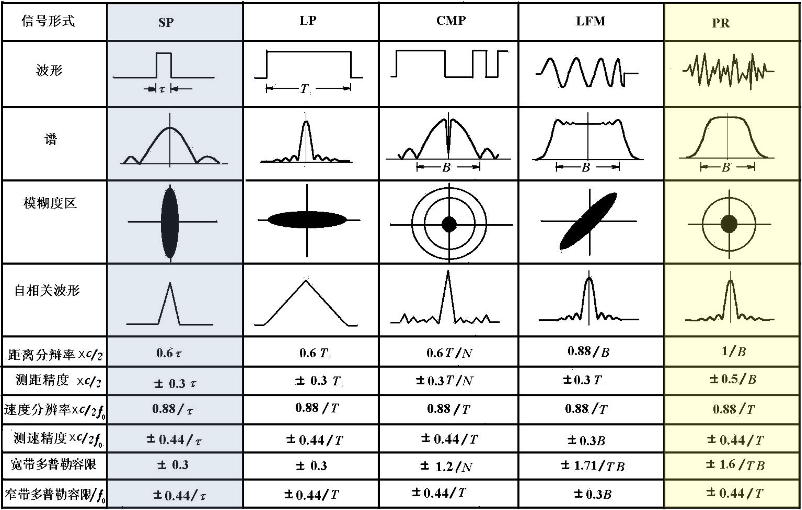

# 声纳与雷达系统 课程报告

吴天宇 12334125

## 物理篇

### 要求

利用 AT 工具箱完成 Ideal 波导和 Pekeris 波导声场计算

1. 利用 Kraken 计算简正模态，并绘制前几阶模态函数。

2. 分别使用简正波 Kraken 和射线 Bellhop 计算声场，并分析两者差异（声速剖面可选取深海和浅海的典型声速剖面）。

### 推导

#### 波动方程

波动方程是描述声波在介质中传播的基本方程，它基于质量守恒和动量守恒的物理原理。在声纳与雷达技术中，波动方程考虑了密度扰动和速度场的关系，其质量守恒方程表达为：

$$
\frac{\partial \rho'}{\partial t} = -\rho_0 \nabla \cdot \mathbf{v}
$$

其中 $\rho'$ 是密度扰动，$\rho_0$ 是平均密度，$\mathbf{v}$ 是速度场。动量守恒，也称为欧拉方程，关联了速度场和压力扰动：

$$
\frac{\partial \mathbf{v}}{\partial t} = -\frac{1}{\rho_0} \nabla p'
$$

其中 $p'$ 表示压力扰动。状态方程进一步将压力扰动和密度扰动联系起来，对于线性介质，其形式为：

$$
p' = \rho' c^2
$$

其中 $c$ 是声速。结合这些方程，我们得到波动方程的标准形式：

$$
\nabla^2 p - \frac{1}{c^2} \frac{\partial^2 p}{\partial t^2} = 0
$$
$$
\nabla^2 \phi - \frac{1}{c^2} \frac{\partial^2 \phi}{\partial t^2} = 0
$$
$$
\nabla^2 \psi - \frac{1}{c^2} \frac{\partial^2 \psi}{\partial t^2} = 0
$$

其中 $p$ 代表声压，$\phi$ 和 $\psi$ 分别代表速度势和位移势，而 $\nabla^2$ 是拉普拉斯算子，表示空间的二阶导数。通过求解这些波动方程，可以预测声波在不同介质中的传播特性，这是声纳和雷达系统分析的基础。

#### 声传播模型

海洋声学环境通常非常复杂，具有距离和深度有关的特性，这种环境一般不适于对声传播作简单的分析预测。即使在距离无关的环境中，也存在许多路径，这些路径组合起来形成复杂的干涉图样。例如，收敛区是一个无法用单调几何扩展定律描述的更复杂结构的例子。声学模型在声传播预测中起着重要作用，这些模型的输入是海洋学量，最终转化为与声学有关的参数，如声速、密度和衰减。

海洋中的声传播用波动方程进行数学描述，波动方程的系数和边界条件由海洋环境导出。基本上有四种类型的模型(波动方程的计算机解)来描述海洋中的声传播，射线、频谱或快速场程序(FFP)、简正模态(NM)和抛物方程(PE)。射线理论是波动方程的一种渐近高频近似，而后三种模型或多或少是波动方程在各种温和约束下的直接解。高频极限不包括衍射现象。这些模型都能很好地处理海洋声环境的深度变化。同时考虑到环境水平变化(例如，倾斜的海底或空间可变的海洋学)的模型被称为距离有关模型。对于高频率(几千赫或以上)，射线理论最实用。其他三种类型在较低频率(1kHz以下)下更适用和可用。水声模型的层次结构如图1所示。这些模型的输出通常是传播损失，即在单位距离上相对于单位源强度，以 dB 表示。传输损耗Transmission Loss是传播损失Propagation Loss的负值，因此是一个正值。不同模型之间存在差异，射线理论预测的阴影区比波动理论模型更尖锐。

    

#### Ideal 波导

Ideal 波导是用来描述在一个理想化环境中声波如何传播的。此模型假设声速在水平方向上是恒定的，并且在垂直方向上没有任何变化。

简正模态在理想波导中的展开可以表示为声压$\Psi(r, z)$的傅里叶级数，其中包括了一系列正弦波形式的模态函数和相应的水平波数$k_{rm}$。对于第m个模态，垂直波数$k_{zm}$和水平波数$k_{rm}$可以表示为：

$$
k_{zm} = \frac{m\pi}{D}
$$

$$
f_{0m} = \frac{mc}{2D}
$$

这里的$D$是波导的深度，$c$是声速，$f_{0m}$是第m个模态的截止频率。而水平波数$k_{rm}$可以通过下面的关系计算得到：

$$
k_{rm} = \sqrt{k^2 - k_{zm}^2} = \sqrt{\left(\frac{\omega}{c}\right)^2 - \left(\frac{m\pi}{D}\right)^2}
$$

其中，$\omega$是角频率，$c$是声速。

声压$\Psi(r, z)$的模态展开形式如下：

$$
\Psi(r, z) = -\frac{iS\omega}{2D} \sum_{m=1}^{\infty} \sin(k_{zm}z)\sin(k_{zm}z_s)H^{(1)}_0(k_{rm}r)
$$

其中，$S$是源项，$z_s$是声源的深度，$H^{(1)}_0$是零阶第一类汉克尔函数，代表径向传播的声波。

声场的相速度$v_m$和群速度$u_m$分别由下列公式给出：

$$
v_m = \frac{\omega}{k_{rm}}
$$

$$
u_m = \frac{d\omega}{dk_{rm}}
$$

Ideal 波导提供了一个简单的框架来理解声波在海洋环境中的基本传播特性，但它忽略了实际海洋环境中的许多复杂因素，如声速剖面的变化、海底的反射和散射等。

#### Pekeris 波导

Pekeris 波导是用来描述在理想条件下声波在水下的传播情况。Pekeris 波导考虑了一个由两层介质组成的简化模型，其中包括一层水体和一层具有不同声学特性的海底。这一模型可以通过数学方式表达和计算不同模态下的声场分布。

在模态展开中，声场可以表示为无穷级数的和，其中每一项都是一个模态的贡献。对于第一模态（Mode 1），其声场可以表示为：

$$
\psi(r, z) \approx -\frac{iS}{2D} \sum_{m=1}^{\infty} \alpha_m \left( k_{rm} \right) \sin\left( k_{zm} z \right) \sin\left( k_{zm} z_s \right) H_0^{(1)} \left( k_{rm} r \right)
$$

这里，$\psi(r, z)$ 是声场的表达式，$i$ 是虚数单位，$S$ 代表声源强度，$D$ 代表水层深度，$\alpha_m$ 是与第 $m$ 个模态相关的系数，$k_{rm}$ 和 $k_{zm}$ 分别是水平和垂直波数，$z$ 是深度变量，$z_s$ 是声源深度，$H_0^{(1)}$ 是第一类零阶汉克尔函数（Hankel function），用于描述远场条件下声波的辐射模式，$r$ 是距离变量。

每个模态的截止频率（Modal Cut-off Frequency）由以下公式给出：

$$
f_{0m} = \left( m - \frac{1}{2} \right) \frac{c_1}{2D} \sqrt{ c_2^2 - c_1^2 }
$$

其中，$f_{0m}$ 是第 $m$ 个模态的截止频率，$c_1$ 和 $c_2$ 分别是两层介质中的声速，$D$ 仍然代表水层深度。

#### Kraken 简正波模型

Kraken 简正波模型用于分析和预测海洋环境中的声波传播。基于波动方程，该模型利用简正波分解直接求解，适用于低频远场条件。

波动方程的垂直部分：

$$ \frac{d^2F}{dz^2} + (k^2 - \zeta^2)F = 0 $$

其中，$F(z)$ 是垂直模态函数，$k$ 是波数，$\zeta$ 是水平波数。

波动方程的径向部分:

$$ \frac{d^2S}{dr^2} + \frac{1}{r}\frac{dS}{dr} + \zeta^2S = 0 $$

其中，$S(r)$ 是径向模态函数。

声场由模态函数表示，对于远场条件，声场的表达式简化为：

$$ \Phi = \sum_{n} \frac{u_n(z) \cdot u_n(z_0)}{\sqrt{\zeta_n}} \exp(i(\zeta_n r - \pi/4)) \exp(-\delta_n r) $$

其中，$u_n(z)$ 是第 $n$ 个模态的垂直模态函数，$\zeta_n$ 是水平波数，$\delta_n$ 是衰减系数。

对于大的 $r$ （远场条件），零阶汉克尔函数近似为：

$$ H_0^{(1)}(\zeta r) \approx \sqrt{\frac{2}{\pi \zeta r}} e^{i(\zeta r-\pi/4)} $$

    

#### Bellhop 射线模型

Bellhop 射线模型是一个基于几何声学的水下声场计算模型，用于高频声信号的传播分析，它假设声波沿着由声速剖面决定的路径即声线传播。声场 $\Phi$ 通常表示为复振幅 $A$ 的指数形式：

$$ \Phi = A e^{i\Psi} $$

在几何声学近似和高频近似下，波动方程可以简化为：

$$ \frac{1}{A} \nabla^2 A - [\nabla \Psi]^2 + k^2 = 0 $$

其中，$[\nabla \Psi]^2 = k^2$ 是高频近似下的简化结果。

射线方程，或称 Eikonal 方程，描述波在非均匀介质中的传播：

$$ 2[\nabla A \cdot \nabla \Psi] + A \nabla^2 \Psi = 0 $$

当频率 $f$ 超过某个阈值，声波可以在声速剖面创建的导管中传播，导管深度 $H$ 和声速 $c$ 对此现象至关重要。此外，射线模型也与波粒二象性量子理论相呼应，反映了声波的波动性和粒子性质。

    

#### 声速剖面

声速剖面通常呈现出随深度变化的非线性特征。声速在声速极小值层或声速通道附近达到最小值，这个区域是由于水温降低和压力增加所共同作用的结果。在声速通道中，声波能够在减小的衰减下进行长距离传播。

声速剖面可以用以下数学公式近似表达：
$$ c(z) = c_0 + a(z - z_0) + b(z - z_0)^2 + \ldots $$
其中，$c(z)$ 是深度 $z$ 处的声速，$c_0$ 是参考深度 $z_0$ 处的声速，$a$ 和 $b$ 是系数，表示声速随深度变化的趋势。

使用 plotssp( ) 函数绘制浅海的声速剖面。

    

### 仿真

使用 AT 工具箱在 MATLAB 进行声场仿真仿真，在 [`Sound_Field_Caculation`](./Sound_Field_Caculation) 中包含用于声场仿真的 MATLAB 代码和资源。

[`Sound_Field_Caculation/lib`](./Sound_Field_Caculation/lib) 包含了多个MATLAB脚本和可执行文件，这些文件为整个仿真提供了必要的计算工具和函数库。其中的MATLAB脚本，如 `read_*.m` 脚本用于读取和处理不同类型的数据文件， `plot*.m` 等脚本则用于绘制和分析仿真结果，[`kraken.exe`](./Sound_Field_Caculation/lib/kraken.exe) 和 [`bellhop.exe`](./Sound_Field_Caculation/lib/bellhop.exe) 是 AT 工具箱仿真的核心计算可执行文件。

[`Sound_Field_Caculation/env`](./Sound_Field_Caculation/env) 包含了各种环境文件和输出结果文件，为仿真提供了必要的声学特性定义和条件。在这个文件夹中，`*.env`文件定义了仿真所需的声学环境特性，如声速剖面、水深和底部特性，`*.flp` 和 `*.prt` 文件涉及仿真参数的设置或结果的后处理，`*.shd` 文件存储了仿真过程中计算出的声场分布。

[`Sound_Field_Caculation`](./Sound_Field_Caculation) 中的 `*.m` 是仿真的主要脚本。[`kraken_main.m`](./Sound_Field_Caculation/kraken_main.m) 用于执行 Kraken 模型的仿真计算，处理与深水或复杂声学环境相关的声场问题，[`bellhop_main.m`](./Sound_Field_Caculation/bellhop_main.m) 用于 Bellhop 模型，适用于浅水或简化环境下的声场仿真。

[`Sound_Field_Caculation/results`](./Sound_Field_Caculation/results) 包含了多个以图像形式存储的仿真结果，展示了声场的分布、模态结构、声速剖面等。

#### 模态计算

[`kraken_Ideal_range_depth_mode.jpg`](./Sound_Field_Caculation/results/kraken_Ideal_range_depth_mode.jpg) 和 [`kraken_Ideal_range_depth_mode_index.jpg`](./Sound_Field_Caculation/results/kraken_Ideal_range_depth_mode_index.jpg)是 Kraken 模型在 Ideal 波导下的简正模态。

    

[`kraken_Pekeris_range_depth_mode.jpg`](./Sound_Field_Caculation/results/kraken_Pekeris_range_depth_mode.jpg) 和 [`kraken_Pekeris_range_depth_mode_index.jpg`](./Sound_Field_Caculation/results/kraken_Pekeris_range_depth_mode_index.jpg)是 Kraken 模型在 Pekeris 波导下的简正模态。

    

#### 声场计算

[`kraken_Ideal_range_shd.jpg`](./Sound_Field_Caculation/results/kraken_Ideal_range_shd.jpg) 是 Kraken 模型在 Ideal 波导条件下的声场传输损失 TL 随距离 Range 的变化。传输损失是衡量声波在传播过程中能量损失的指标，尤其是衡量远距离传播时的能量衰减情况。

    

[`kraken_Ideal_range_depth_shd.jpg`](./Sound_Field_Caculation/results/kraken_Ideal_range_depth_shd.jpg) 是 Kraken 模型在 Ideal 波导条件下声场在水平距离和深度上的分布，其中颜色的变化代表了不同声压级的分布。

    

[`kraken_Pekeris_range_shd.jpg`](./Sound_Field_Caculation/results/kraken_Pekeris_range_shd.jpg) 是 Kraken 模型在 Pekeris 波导条件下的声场传输损失 TL 随距离 Range 的变化。传输损失是衡量声波在传播过程中能量损失的指标，尤其是衡量远距离传播时的能量衰减情况。

    

[`kraken_Pekeris_range_depth_shd.jpg`](./Sound_Field_Caculation/results/kraken_Pekeris_range_depth_shd.jpg) 是 Kraken 模型在 Pekeris 波导条件下声场在水平距离和深度上的分布，其中颜色的变化代表了不同声压级的分布。

    

[`bellhop_Ideal_range_depth.jpg`](./Sound_Field_Caculation/results/bellhop_Ideal_range_depth.jpg) 是 Bellhop 模型在 Ideal 波导条件下声场在水平距离和深度上的分布，其中颜色的变化代表了不同声压级的分布。

[`bellhop_Pekeris_range_depth.jpg`](./Sound_Field_Caculation/results/bellhop_Pekeris_range_depth.jpg) 是 Bellhop 模型在 Pekeris 波导条件下声场在水平距离和深度上的分布，其中颜色的变化代表了不同声压级的分布。

    

## 波形篇

### 要求

典型波形的模糊以及信道输出和信道响应

1. 生成典型波形（如 CW、LFM、HFM、M 码、巴克码、Gold 码、FMCW 等）。

2. 计算并绘制典型波形的模糊度图（含上调频和下调频，至少对比两种不同时间带宽积情况下模糊度图）。

3. 任选两种波形作为 Bellhop 声场软件的信号输入，计算并绘制输出波形，分析其与输入信号之间的差异。

4. 利用输入和输出信号计算水声信道脉冲响应和频率响应，分析其与信道真实响应之间的差异。

### 推导

#### 波形生成

##### 窄带信号（带限、带通）

窄带信号是指其频谱集中在一个较窄的频带内的信号。这类信号通常经过带通滤波器进行处理，以限制其频谱范围。数学上，窄带信号可以表示为：

$$
s(t) = A(t) \cos(2\pi f_c t + \phi(t))
$$

其中 $A(t)$ 是信号的包络，$f_c$ 是载波频率，$\phi(t)$ 是相位信息。

回波窄带信号是指经过窄带处理的回波信号，它仅包含目标反射回来的特定频率范围内的信号。回波基带复包络是指将回波窄带信号通过解调转换到基带的信号包络，与基带复包络的概念相同，但应用于回波信号。

##### 基带复包络

基带复包络是指将高频载波信号通过解调转换到低频（基带）上的信号包络。它包含了原始信号的幅度和相位信息。数学表示为：

$$
s_{\text{base}}(t) = A(t) e^{j\phi(t)}
$$

##### 希尔伯特变换

希尔伯特变换用于从实值信号生成解析信号，解析信号具有实部和虚部。数学上，希尔伯特变换定义为：

$$
\hat{s}(t) = \frac{1}{\pi} \text{P.V.} \int_{-\infty}^{\infty} \frac{s(\tau)}{t - \tau} d\tau
$$

其中，$\text{P.V.}$ 表示柯西主值。

##### 正交解调

正交解调是将接收到的信号分解为两个正交分量（同相分量和正交分量）的过程。对于信号 $s(t) = A(t) \cos(2\pi f_c t + \phi(t))$，其同相分量 $I(t)$ 和正交分量 $Q(t)$ 可以表示为：

$$
I(t) = A(t) \cos(\phi(t))
$$
$$
Q(t) = A(t) \sin(\phi(t))
$$

##### 解析信号

解析信号是将实值信号扩展到复平面的信号，其实部为原信号，虚部为原信号的希尔伯特变换。数学上，对于信号 $s(t)$，其解析信号表示为：

$$
s_{\text{analytic}}(t) = s(t) + j\hat{s}(t)
$$

##### 多普勒频移

时延是指信号从发射到接收之间的时间差。多普勒频移是指由于相对运动引起的频率变化。对于一个运动中的目标，其反射回波的多普勒频移可以表示为：

$$
f_d = \frac{2v}{\lambda}
$$

其中 $f_d$ 是多普勒频移，$v$ 是目标相对于观察者的速度，$\lambda$ 是波长。

#### 匹配滤波器

匹配滤波器是一种信号处理技术，用于最大化信号和已知模板之间的相关性。在白噪声环境下，匹配滤波器可以最大化接收信号的信噪比（SNR）。匹配滤波器的脉冲响应 $h_{mf}(t)$ 与发送信号的时间反转复共轭有关，数学表达为：

$$
h_{mf}(t) = k \cdot u^*(t_1 - t)
$$

其中，$u(t)$ 是发送信号，$k$ 是常数因子，$t_1$ 是时间反转的参考点。对应的频率响应 $H_{mf}(f)$ 是：

$$
H_{mf}(f) = k \cdot U^*(f)e^{-j2\pi f t_1}
$$

匹配滤波器输出的信噪比（SNR）由下式给出：

$$
\frac{S}{N}_{mf} = \frac{2E}{N_0}
$$

其中，$E$ 是接收回波的能量，$N_0$ 是单位频带内的白噪声功率谱密度。

匹配滤波器的增益可以通过输出和输入SNR的比值来定义：

$$
TB = \frac{{SNR}_{output}}{{SNR}_{input}}
$$

这里 $TB$ 是时间-带宽积，一个描述信号时频特性的重要参数。

#### 脉冲压缩

脉冲压缩是一种信号处理技术，主要用于雷达和声纳系统，以提高距离分辨率和信噪比。它涉及到时域和频域的处理方法。

##### 时域脉冲压缩

时域脉冲压缩是通过匹配滤波来实现的。匹配滤波器的脉冲响应是传输脉冲的时间反转和复共轭。在白噪声条件下，匹配滤波器可以最大化输出的信噪比。具体的数学表达为：

$$
h(t) = s^*(-t)
$$

其中，$h(t)$ 是匹配滤波器的脉冲响应，$s(t)$ 是传输脉冲。

##### 频域脉冲压缩

频域脉冲压缩是在频域通过滤波实现的，与时域脉冲压缩对应。在频域中，匹配滤波器的频率响应是传输信号频谱的复共轭。其表达式为：

$$
H(f) = S^*(f)
$$

其中，$H(f)$ 是匹配滤波器的频率响应，$S(f)$ 是传输信号的频谱。

##### LFM脉冲压缩

LFM（线性频率调制）脉冲压缩是通过线性调频信号来实现的。它结合了短脉冲的高距离分辨率和长脉冲的高速度分辨率的优点。LFM信号具有一个大的时间-带宽积（TB），其中 TB 值为10意味着比 CW（连续波）脉冲有更高的距离分辨率和速度分辨率，同时也能实现更远的作用距离。

LFM脉冲压缩的数学表达式为：

$$
s(t) = \cos(2\pi f_0 t + \pi \beta t^2)
$$

其中，$f_0$ 是中心频率，$\beta$ 是调频率，$t$ 是时间。

##### HFM脉冲压缩

HFM（高斯频率调制）脉冲压缩是通过高斯调频信号来实现的。它结合了短脉冲的高距离分辨率和长脉冲的高速度分辨率的优点。HFM信号具有一个大的时间-带宽积（TB），其中 TB 值为10意味着比 CW（连续波）脉冲有更高的距离分辨率和速度分辨率，同时也能实现更远的作用距离。

HFM脉冲压缩的数学表达式为：

$$
s(t) = \cos(2\pi f_0 t + \pi \beta t^2)
$$

其中，$f_0$ 是中心频率，$\beta$ 是调频率，$t$ 是时间。

#### 模糊函数

模糊函数（Ambiguity Function）是描述信号在时延和多普勒频移（Doppler Shift）下的相似度。对于基带信号$u(t)$，其模糊函数$X_u(\tau, f_d)$定义为：

$$
X_u(\tau, f_d) = \int_{-\infty}^{\infty} u(t)u^*(t + \tau)e^{-j2\pi f_d t} dt
$$

其中，$\tau$ 是相对时间延迟，$f_d$ 是多普勒频移。模糊函数的绝对值平方$|\Psi_u(\tau, f_d)|^2$表示信号在时延和多普勒频移下的能量分布。

模糊度图（Ambiguity Diagram）是模糊函数的图形表示，通常在延迟-多普勒（$\tau$-$f_d$）坐标系中描绘，用于直观显示信号的时间-频率分辨能力。模糊度图通常显示为一个三维图，其中峰值表示主瓣，而其它结构表示旁瓣。

    

#### 基带复包络的自相关函数

基带复包络的自相关函数是信号自身与其时间延迟版本的卷积，描述了信号在不同时间延迟下的自相似性，定义为：

$$
R_u(\tau) = \int_{-\infty}^{\infty} u(t)u^*(t + \tau) dt
$$

#### 匹配滤波器输出

匹配滤波器输出是接收信号和匹配滤波器脉冲响应的卷积，它等同于基带复包络的自相关函数的时间反转。如果$u(t)$是发送信号，匹配滤波器输出$y(t)$为：

$$
y(t) = \int_{-\infty}^{\infty} u(t)u^*(t' - t)e^{-j2\pi f_d t'} dt'
$$

#### 时频分析

时频分析是一种分析信号在时间和频率上变化的技术。一些常用的时频分析方法包括短时傅里叶变换（STFT）、连续小波变换（CWT）、离散小波变换（DWT）等。

时域波形是信号在时间上的表示，而频域频谱是信号在频率上的表示。通过傅里叶变换可以将时域波形转换为频域频谱，反之亦然。

时频分辨率与Heisenberg不确定原理说明了在时频分析中，时间分辨率$\Delta t$和频率分辨率$\Delta f$不能同时任意精确，它们的乘积受到限制：

$$
\Delta t \cdot \Delta f \geq \frac{1}{2}
$$

这表明信号的时间和频率特性存在一个基本的权衡。

#### 简单信号

简单信号（Simple Signal）通常指的是具有确定时间带宽积（TB）的信号。时间带宽积是信号持续时间和带宽的乘积，是信号设计中一个重要的参数。在声纳和雷达系统中，简单信号通常用于基本的目标检测和定位。

##### 时间带宽积（TB）

时间带宽积描述了信号的时域和频域特性之间的权衡关系。对于简单信号，时间带宽积通常满足以下条件：

当 $TB = 1$ 时，信号为最佳匹配脉冲，提供最好的时间解析能力。当 $TB >> 1$ 时，信号可以提供更好的多普勒解析能力。

##### CW脉冲的情况

CW脉冲，或连续波（Continuous Wave）脉冲，其时间带宽积较小，主要用于测量目标的距离。其特性可以用以下公式描述：

$$
\Delta R = \frac{c \tau_e}{2} = \frac{c}{2 B_e}
$$

$$
\Delta f_d = \frac{1}{\tau_e}
$$

其中，$c$ 是声速，$\tau_e$ 是信号的有效持续时间，$B_e$ 是信号的有效带宽，$\Delta R$ 是距离分辨率，$\Delta f_d$ 是多普勒分辨率。

有效持续时间$\tau_e$和有效带宽$B_e$可以分别通过信号的自相关函数和功率谱密度来计算：

$$
\tau_e = \frac{\int_{-\infty}^{\infty} |x(t)|^2 dt}{\int_{-\infty}^{\infty} |x(t)|^4 dt}
$$

$$
B_e = \frac{\int_{-\infty}^{\infty} |X(f)|^2 df}{\int_{-\infty}^{\infty} |X(f)|^4 df}
$$

其中$x(t)$是信号的时域表达式，$X(f)$是信号的频域表达式。

以上公式说明了简单信号在设计时需要考虑的时延和多普勒特性，以及如何通过信号的形状来调整这些特性，以满足特定的应用需求。

#### 典型波形

##### CW

连续波（Continuous Wave，CW）是一种不间断的波形，其频率和振幅都是恒定的。CW 信号的频谱是一个单频信号，其频率为 CW 信号的频率，幅度为 CW 信号的幅度。CW 信号的频谱是一个单频信号，其频率为 CW 信号的频率，幅度为 CW 信号的幅度。CW 信号的频谱是一个单频信号，其频率为 CW 信号的频率，幅度为 CW 信号的幅度。CW 信号的频谱是一个单频信号，其频率为 CW 信号的频率，幅度为 CW 信号的幅度。

##### LFM

线性调频（Linear Frequency Modulation，LFM）信号是一种频率随时间线性变化的信号，其频率随时间的变化率称为调频率，调频率的倒数称为调宽。LFM 信号的频谱是一个宽度为调宽的矩形，其中心频率为 LFM 信号的中心频率，幅度为 LFM 信号的幅度。

##### HFM

高斯调频（Gaussian Frequency Modulation，HFM）信号是一种频率随时间高斯变化的信号，其频率随时间的变化率称为调频率，调频率的倒数称为调宽。HFM 信号的频谱是一个宽度为调宽的高斯曲线，其中心频率为 HFM 信号的中心频率，幅度为 HFM 信号的幅度。

##### M 码

M 码信号是一种频率随时间随机变化的信号，其频率随时间的变化率称为调频率，调频率的倒数称为调宽。M 码信号的频谱是一个宽度为调宽的随机曲线，其中心频率为 M 码信号的中心频率，幅度为 M 码信号的幅度。

##### 巴克码

巴克码信号是一种频率随时间随机变化的信号，其频率随时间的变化率称为调频率，调频率的倒数称为调宽。巴克码信号的频谱是一个宽度为调宽的随机曲线，其中心频率为巴克码信号的中心频率，幅度为巴克码信号的幅度。

##### Gold 码

Gold 码信号是一种频率随时间随机变化的信号，其频率随时间的变化率称为调频率，调频率的倒数称为调宽。Gold 码信号的频谱是一个宽度为调宽的随机曲线，其中心频率为 Gold 码信号的中心频率，幅度为 Gold 码信号的幅度。

##### FMCW

调频连续波（Frequency Modulated Continuous Wave，FMCW）信号是一种频率随时间线性变化的信号，其频率随时间的变化率称为调频率，调频率的倒数称为调宽。FMCW 信号的频谱是一个宽度为调宽的矩形，其中心频率为 FMCW 信号的中心频率，幅度为 FMCW 信号的幅度。

#### 信道输出

信道输出是指信道中的信号经过信道传输后的输出信号，它可以用来分析信道的传输特性，如传输损耗、传输延迟、传输失真等。信道输出是指信道中的信号经过信道传输后的输出信号，它可以用来分析信道的传输特性，如传输损耗、传输延迟、传输失真等。信道输出是指信道中的信号经过信道传输后的输出信号，它可以用来分析信道的传输特性，如传输损耗、传输延迟、传输失真等。信道输出是指信道中的信号经过信道传输后的输出信号，它可以用来分析信道的传输特性，如传输损耗、传输延迟、传输失真等。

#### 信道响应

信道响应是指信道中的信号经过信道传输后的输出信号，它可以用来分析信道的传输特性，如传输损耗、传输延迟、传输失真等。信道响应是指信道中的信号经过信道传输后的输出信号，它可以用来分析信道的传输特性，如传输损耗、传输延迟、传输失真等。信道响应是指信道中的信号经过信道传输后的输出信号，它可以用来分析信道的传输特性，如传输损耗、传输延迟、传输失真等。信道响应是指信道中的信号经过信道传输后的输出信号，它可以用来分析信道的传输特性，如传输损耗、传输延迟、传输失真等。

### 仿真

1
